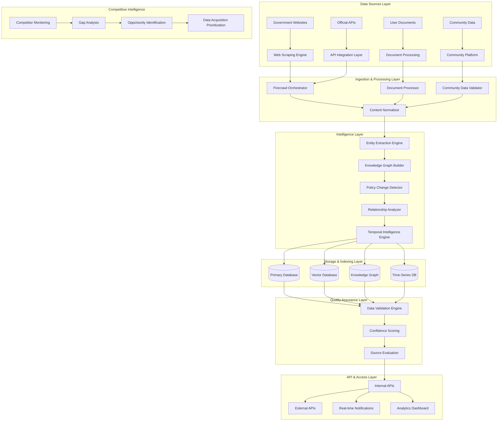
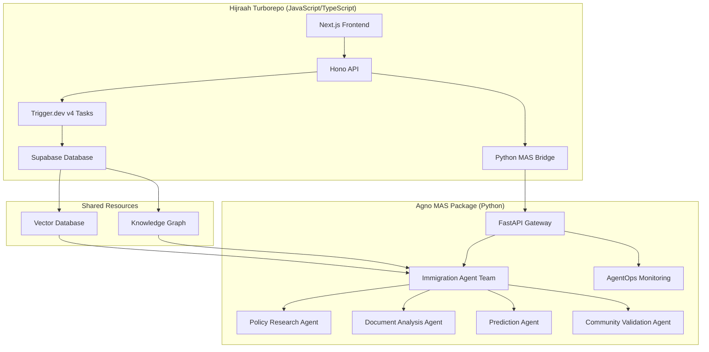

# Design Document

## Overview

This document outlines the comprehensive design for Hijraah's data acquisition and competitive differentiation strategy. The system will establish Hijraah as the leading immigration platform by building the most comprehensive, accurate, and actionable immigration data ecosystem available. The design leverages Context7 patterns, the existing Turborepo monorepo structure, and advanced AI capabilities to create a sustainable competitive advantage through superior data quality and coverage.

## Architecture

### High-Level System Architecture



### Context7 Architecture Patterns

The system implements all seven Context7 patterns:

1. **Observability**: Comprehensive logging, metrics, and tracing across all data pipelines
2. **Modularity**: Microservices architecture with clear boundaries and interfaces
3. **Resumability**: Fault-tolerant processing with checkpoint and resume capabilities
4. **Tracing**: End-to-end request tracing from data source to user consumption
5. **Data-as-Code**: Version-controlled data schemas and transformation logic
6. **Infrastructure-as-Code**: Terraform-managed cloud resources and configurations
7. **Provider Isolation**: Abstracted interfaces for different data sources and AI providers

## Components and Interfaces

### 1. Data Acquisition Engine (@hijraah/data-acquisition)

**Core Responsibilities:**

- Multi-source data collection orchestration
- Rate limiting and respectful scraping
- API integration management
- Real-time change detection

**Key Components:**

```typescript
// packages/hijraah-data-acquisition/src/orchestrator.ts
export class DataAcquisitionOrchestrator {
  private scrapers: Map<string, WebScraper>;
  private apiClients: Map<string, APIClient>;
  private scheduler: JobScheduler;
  private changeDetector: PolicyChangeDetector;

  async collectFromSource(source: DataSource): Promise<CollectionResult>;
  async detectChanges(source: DataSource): Promise<ChangeEvent[]>;
  async scheduleCollection(
    source: DataSource,
    schedule: CronSchedule,
  ): Promise<void>;
}

// packages/hijraah-data-acquisition/src/scrapers/government-scraper.ts
export class GovernmentWebScraper extends BaseWebScraper {
  async scrapeImmigrationPolicies(country: string): Promise<PolicyDocument[]>;
  async detectPolicyChanges(country: string): Promise<PolicyChange[]>;
  async extractRequirements(policyUrl: string): Promise<Requirement[]>;
}

// packages/hijraah-data-acquisition/src/apis/official-api-client.ts
export class OfficialAPIClient extends BaseAPIClient {
  async fetchVisaTypes(country: string): Promise<VisaType[]>;
  async getProcessingTimes(visaType: string): Promise<ProcessingTime[]>;
  async checkApplicationStatus(
    applicationId: string,
  ): Promise<ApplicationStatus>;
}
```

**Integration Points:**

- Firecrawl for web scraping
- Trigger.dev for scheduled jobs
- Redis for rate limiting and caching
- Supabase for data storage

### 2. Knowledge Graph Engine (@hijraah/knowledge-graph)

**Core Responsibilities:**

- Entity extraction and relationship mapping
- Temporal reasoning and policy tracking
- Graph traversal and path finding
- Confidence scoring and validation

**Key Components:**

```typescript
// packages/hijraah-knowledge-graph/src/builder.ts
export class KnowledgeGraphBuilder {
  private entityExtractor: EntityExtractor;
  private relationshipMapper: RelationshipMapper;
  private temporalEngine: TemporalReasoningEngine;
  private confidenceScorer: ConfidenceScorer;

  async buildFromDocument(document: ProcessedDocument): Promise<GraphUpdate>;
  async extractEntities(content: string): Promise<Entity[]>;
  async mapRelationships(entities: Entity[]): Promise<Relationship[]>;
  async updateTemporalData(entity: Entity, timestamp: Date): Promise<void>;
}

// packages/hijraah-knowledge-graph/src/temporal-engine.ts
export class TemporalReasoningEngine {
  async trackPolicyChanges(
    entity: Entity,
    changes: PolicyChange[],
  ): Promise<void>;
  async getPolicyAtTime(entity: Entity, timestamp: Date): Promise<PolicyState>;
  async predictPolicyTrends(entity: Entity): Promise<TrendPrediction>;
}

// packages/hijraah-knowledge-graph/src/graph-traversal.ts
export class GraphTraversalEngine {
  async findShortestPath(source: Entity, target: Entity): Promise<Path[]>;
  async getRelatedEntities(entity: Entity, depth: number): Promise<Entity[]>;
  async calculateEntityImportance(entity: Entity): Promise<number>;
}
```

### 3. Predictive Analytics Engine (@hijraah/analytics)

**Core Responsibilities:**

- Success probability modeling
- Timeline prediction
- Cost estimation
- Risk assessment

**Key Components:**

```typescript
// packages/hijraah-analytics/src/prediction-engine.ts
export class PredictionEngine {
  private models: Map<string, MLModel>;
  private featureExtractor: FeatureExtractor;
  private validator: PredictionValidator;

  async predictSuccessProbability(
    profile: UserProfile,
    pathway: ImmigrationPathway,
  ): Promise<Prediction>;
  async estimateTimeline(
    profile: UserProfile,
    pathway: ImmigrationPathway,
  ): Promise<TimelineEstimate>;
  async calculateCosts(pathway: ImmigrationPathway): Promise<CostEstimate>;
  async assessRisks(
    profile: UserProfile,
    pathway: ImmigrationPathway,
  ): Promise<RiskAssessment>;
}

// packages/hijraah-analytics/src/ml-models.ts
export class MLModelManager {
  async trainSuccessModel(trainingData: TrainingDataset): Promise<MLModel>;
  async updateModel(model: MLModel, newData: TrainingDataset): Promise<MLModel>;
  async validateModel(
    model: MLModel,
    testData: TestDataset,
  ): Promise<ValidationResult>;
}
```

### 4. Community Data Platform (@hijraah/community)

**Core Responsibilities:**

- User experience data collection
- Community validation and verification
- Crowdsourced timeline tracking
- Feedback aggregation and analysis

**Key Components:**

```typescript
// packages/hijraah-community/src/experience-collector.ts
export class ExperienceCollector {
  async collectUserExperience(
    userId: string,
    milestone: Milestone,
  ): Promise<Experience>;
  async validateExperience(experience: Experience): Promise<ValidationResult>;
  async aggregateExperiences(
    pathway: ImmigrationPathway,
  ): Promise<AggregatedData>;
}

// packages/hijraah-community/src/validation-engine.ts
export class CommunityValidationEngine {
  async validateTimeline(
    timeline: Timeline,
    communityData: Experience[],
  ): Promise<ValidationScore>;
  async detectOutliers(experiences: Experience[]): Promise<Outlier[]>;
  async calculateConfidence(data: AggregatedData): Promise<ConfidenceScore>;
}
```

### 5. Competitive Intelligence System (@hijraah/competitive-intel)

**Core Responsibilities:**

- Competitor platform monitoring
- Feature gap analysis
- Data coverage comparison
- Market opportunity identification

**Key Components:**

```typescript
// packages/hijraah-competitive-intel/src/competitor-monitor.ts
export class CompetitorMonitor {
  private platforms: Map<string, CompetitorPlatform>;
  private analyzer: FeatureAnalyzer;
  private gapDetector: GapDetector;

  async monitorCompetitor(
    platform: CompetitorPlatform,
  ): Promise<CompetitorData>;
  async analyzeFeatures(platform: CompetitorPlatform): Promise<FeatureAnalysis>;
  async identifyGaps(
    ourData: PlatformData,
    competitorData: CompetitorData,
  ): Promise<Gap[]>;
}

// packages/hijraah-competitive-intel/src/opportunity-engine.ts
export class OpportunityEngine {
  async identifyDataOpportunities(gaps: Gap[]): Promise<DataOpportunity[]>;
  async prioritizeOpportunities(
    opportunities: DataOpportunity[],
  ): Promise<PrioritizedOpportunity[]>;
  async generateAcquisitionPlan(
    opportunity: DataOpportunity,
  ): Promise<AcquisitionPlan>;
}
```

## Data Models

### Core Data Structures

```typescript
// Enhanced data models for comprehensive immigration data

export interface DataSource {
  id: string;
  name: string;
  type: "government" | "api" | "community" | "document";
  url?: string;
  apiEndpoint?: string;
  credibilityScore: number;
  updateFrequency: string; // cron expression
  lastUpdated: Date;
  metadata: {
    country?: string;
    language?: string;
    authority?: string;
    coverage?: string[];
  };
}

export interface PolicyDocument {
  id: string;
  sourceId: string;
  title: string;
  content: string;
  url: string;
  publishedDate: Date;
  effectiveDate: Date;
  expiryDate?: Date;
  country: string;
  policyType: string;
  entities: Entity[];
  changes: PolicyChange[];
  confidence: number;
}

export interface Entity {
  id: string;
  name: string;
  type: EntityType;
  properties: Record<string, any>;
  confidence: number;
  sources: string[];
  embedding: number[];
  temporalData: TemporalData[];
}

export interface Relationship {
  id: string;
  sourceEntityId: string;
  targetEntityId: string;
  type: RelationshipType;
  strength: number;
  confidence: number;
  temporalValidity: {
    validFrom: Date;
    validTo?: Date;
  };
  properties: Record<string, any>;
}

export interface UserExperience {
  id: string;
  userId: string;
  pathway: ImmigrationPathway;
  milestone: Milestone;
  actualTimeline: number; // days
  actualCost: number;
  difficulty: number; // 1-10 scale
  success: boolean;
  feedback: string;
  verificationStatus: "pending" | "verified" | "disputed";
  submittedAt: Date;
}

export interface Prediction {
  type: "success" | "timeline" | "cost" | "risk";
  value: number;
  confidence: number;
  factors: PredictionFactor[];
  model: string;
  generatedAt: Date;
}

export interface CompetitorData {
  platform: string;
  features: Feature[];
  dataCoverage: DataCoverage;
  userBase: number;
  lastAnalyzed: Date;
  strengths: string[];
  weaknesses: string[];
}
```

## Error Handling

### Comprehensive Error Management Strategy

```typescript
// packages/hijraah-data-acquisition/src/errors.ts
export class DataAcquisitionError extends Error {
  constructor(
    message: string,
    public code: string,
    public source: string,
    public retryable: boolean = true,
    public details?: any,
  ) {
    super(message);
    this.name = "DataAcquisitionError";
  }
}

export class DataQualityError extends Error {
  constructor(
    message: string,
    public dataId: string,
    public qualityIssues: QualityIssue[],
    public severity: "low" | "medium" | "high" | "critical",
  ) {
    super(message);
    this.name = "DataQualityError";
  }
}

// Error handling patterns
export class ErrorHandler {
  async handleScrapingError(error: DataAcquisitionError): Promise<void> {
    // Log error with context
    await this.logError(error);

    // Determine retry strategy
    if (error.retryable) {
      await this.scheduleRetry(error.source);
    } else {
      await this.alertAdministrators(error);
    }

    // Update source reliability score
    await this.updateSourceReliability(error.source, false);
  }

  async handleDataQualityIssue(error: DataQualityError): Promise<void> {
    // Quarantine problematic data
    await this.quarantineData(error.dataId);

    // Trigger manual review for critical issues
    if (error.severity === "critical") {
      await this.triggerManualReview(error);
    }

    // Update confidence scores
    await this.updateConfidenceScores(error.qualityIssues);
  }
}
```

## Testing Strategy

### Multi-Layer Testing Approach

```typescript
// packages/hijraah-data-acquisition/src/__tests__/integration.test.ts
describe("Data Acquisition Integration Tests", () => {
  test("should successfully scrape and process government website", async () => {
    const scraper = new GovernmentWebScraper();
    const result = await scraper.scrapeImmigrationPolicies("CA");

    expect(result.documents).toHaveLength(greaterThan(0));
    expect(result.entities).toHaveLength(greaterThan(0));
    expect(result.confidence).toBeGreaterThan(0.8);
  });

  test("should detect policy changes accurately", async () => {
    const detector = new PolicyChangeDetector();
    const changes = await detector.detectChanges("immigration-policy-url");

    expect(changes).toBeDefined();
    expect(changes.every((change) => change.confidence > 0.7)).toBe(true);
  });
});

// packages/hijraah-knowledge-graph/src/__tests__/graph-builder.test.ts
describe("Knowledge Graph Builder Tests", () => {
  test("should build accurate entity relationships", async () => {
    const builder = new KnowledgeGraphBuilder();
    const document = createMockPolicyDocument();

    const result = await builder.buildFromDocument(document);

    expect(result.entities).toHaveLength(greaterThan(0));
    expect(result.relationships).toHaveLength(greaterThan(0));
    expect(result.confidence).toBeGreaterThan(0.8);
  });
});

// End-to-end testing
describe("Data Pipeline E2E Tests", () => {
  test("should process data from source to user-facing API", async () => {
    // Simulate complete data flow
    const source = createMockDataSource();
    const orchestrator = new DataAcquisitionOrchestrator();

    // Collect data
    const collectionResult = await orchestrator.collectFromSource(source);
    expect(collectionResult.success).toBe(true);

    // Verify knowledge graph update
    const graphBuilder = new KnowledgeGraphBuilder();
    const graphResult = await graphBuilder.buildFromDocument(
      collectionResult.document,
    );
    expect(graphResult.entities.length).toBeGreaterThan(0);

    // Verify API accessibility
    const api = new DataAPI();
    const searchResult = await api.search("visa requirements");
    expect(searchResult.results.length).toBeGreaterThan(0);
  });
});
```

### Performance Testing

```typescript
// Performance benchmarks for data processing
describe("Performance Tests", () => {
  test("should process 1000 documents within 5 minutes", async () => {
    const processor = new DocumentProcessor();
    const documents = generateMockDocuments(1000);

    const startTime = Date.now();
    const results = await processor.processBatch(documents);
    const endTime = Date.now();

    expect(endTime - startTime).toBeLessThan(5 * 60 * 1000); // 5 minutes
    expect(results.successRate).toBeGreaterThan(0.95);
  });

  test("should handle concurrent scraping of 50 sources", async () => {
    const orchestrator = new DataAcquisitionOrchestrator();
    const sources = generateMockSources(50);

    const startTime = Date.now();
    const results = await Promise.all(
      sources.map((source) => orchestrator.collectFromSource(source)),
    );
    const endTime = Date.now();

    expect(endTime - startTime).toBeLessThan(10 * 60 * 1000); // 10 minutes
    expect(results.filter((r) => r.success).length).toBeGreaterThan(45);
  });
});
```

## Performance Considerations

### Scalability and Optimization

**Data Processing Pipeline:**

- Parallel processing with configurable concurrency limits
- Streaming data processing for large documents
- Incremental updates to avoid full reprocessing
- Intelligent caching at multiple layers

**Storage Optimization:**

- Partitioned tables for time-series data
- Optimized indexes for common query patterns
- Data compression for archival storage
- Automated data lifecycle management

**API Performance:**

- Response caching with intelligent invalidation
- Rate limiting with user-based quotas
- Connection pooling and resource management
- CDN integration for static content

**Monitoring and Alerting:**

- Real-time performance metrics
- Automated scaling triggers
- Proactive error detection
- Capacity planning dashboards

### Resource Management

```typescript
// packages/hijraah-data-acquisition/src/resource-manager.ts
export class ResourceManager {
  private connectionPools: Map<string, ConnectionPool>;
  private rateLimiters: Map<string, RateLimiter>;
  private memoryMonitor: MemoryMonitor;

  async acquireConnection(source: string): Promise<Connection> {
    const pool = this.connectionPools.get(source);
    return await pool.acquire();
  }

  async checkRateLimit(source: string, operation: string): Promise<boolean> {
    const limiter = this.rateLimiters.get(source);
    return await limiter.checkLimit(operation);
  }

  async monitorMemoryUsage(): Promise<MemoryStats> {
    return await this.memoryMonitor.getStats();
  }
}
```

## Security and Privacy

### Data Protection Strategy

**Encryption:**

- End-to-end encryption for sensitive data
- Field-level encryption for PII
- Encrypted data transmission
- Secure key management

**Access Control:**

- Role-based access control (RBAC)
- API key management
- Audit logging for all data access
- Regular security assessments

**Privacy Compliance:**

- GDPR compliance for EU users
- Data retention policies
- Right to deletion implementation
- Consent management

**Data Anonymization:**

- PII detection and masking
- Differential privacy for analytics
- Secure aggregation techniques
- User data isolation

## Integration Points

### External System Integration

**Existing Hijraah Systems:**

- RAG Pipeline integration for enhanced search
- Chat system integration for real-time data access
- User profile system for personalized data
- Document management for user uploads

**Third-Party Services:**

- Firecrawl for web scraping
- OpenAI for entity extraction and analysis
- Upstash for caching and rate limiting
- Trigger.dev for job orchestration
- Agno for multi-agent system capabilities

**Government APIs:**

- Official immigration APIs where available
- Real-time policy update feeds
- Application status checking
- Fee and processing time updates

### API Design

```typescript
// packages/hijraah-data-acquisition/src/api/routes.ts
export class DataAcquisitionAPI {
  // Search immigration data
  @GET("/api/data/search")
  async search(
    @Query("q") query: string,
    @Query("country") country?: string,
    @Query("type") type?: string,
  ): Promise<SearchResult> {
    // Implementation
  }

  // Get policy changes
  @GET("/api/data/changes")
  async getPolicyChanges(
    @Query("since") since: Date,
    @Query("country") country?: string,
  ): Promise<PolicyChange[]> {
    // Implementation
  }

  // Submit community data
  @POST("/api/data/community")
  async submitExperience(
    @Body() experience: UserExperience,
  ): Promise<SubmissionResult> {
    // Implementation
  }

  // Get predictions
  @POST("/api/data/predict")
  async getPrediction(@Body() request: PredictionRequest): Promise<Prediction> {
    // Implementation
  }
}
```

### 6. Multi-Agent System (MAS) Engine (@hijraah/mas)

**Core Responsibilities:**

- Specialized agent coordination and orchestration
- Immigration policy analysis and reasoning
- Document understanding and contextual analysis
- Prediction and recommendation generation
- Cross-agent memory and context sharing

**Architecture Integration:**

The Agno Multi-Agent System integrates seamlessly with the existing Turborepo architecture through a hybrid approach:



**Key Components:**

```python
# packages/hijraah-mas/src/hijraah_mas/teams/immigration_team.py
class ImmigrationTeam:
    def __init__(self, supabase_url: str, supabase_key: str):
        # Initialize individual agents
        self.immigration_agent = ImmigrationAgent(supabase_url, supabase_key).agent
        self.policy_agent = PolicyResearchAgent(supabase_url, supabase_key).agent
        self.document_agent = DocumentAnalysisAgent(supabase_url, supabase_key).agent
        self.prediction_agent = PredictionAgent(supabase_url, supabase_key).agent

        # Create coordinated team
        self.team = Team(
            name="Immigration Advisory Team",
            mode="coordinate",
            model=Claude(id="claude-sonnet-4-20250514"),
            members=[
                self.immigration_agent,
                self.policy_agent,
                self.document_agent,
                self.prediction_agent,
            ],
            instructions=[
                "Collaborate to provide comprehensive immigration analysis",
                "Each agent should contribute their specialized expertise",
                "Ensure all advice is current and legally accurate",
                "Provide actionable recommendations with timelines",
                "Include risk assessments and success probabilities",
            ],
            success_criteria="Complete immigration analysis with policy research, document review, predictions, and actionable recommendations",
            markdown=True,
            show_members_responses=True,
            enable_agentic_context=True,
        )

    async def process_immigration_query(self, user_data: dict, query: str) -> dict:
        prompt = f"""
        User Information: {user_data}
        Immigration Query: {query}

        Please provide a comprehensive analysis including:
        1. Current policy status and requirements
        2. Document analysis and recommendations
        3. Success probability and timeline predictions
        4. Step-by-step action plan
        """

        response = await self.team.arun(prompt)
        return {
            "analysis": response.content,
            "agents_used": [member.name for member in self.team.members],
            "confidence_score": self._calculate_confidence(response),
        }

# packages/hijraah-mas/src/hijraah_mas/agents/immigration_agent.py
class ImmigrationAgent:
    def __init__(self, supabase_url: str, supabase_key: str):
        self.agent = Agent(
            name="Immigration Specialist",
            role="Provide expert immigration advice and policy analysis",
            model=OpenAIChat(id="gpt-4o"),
            tools=[
                SupabaseTools(url=supabase_url, key=supabase_key),
                VectorSearchTools(),
                DuckDuckGoTools(),
            ],
            instructions=[
                "You are an expert immigration consultant with deep knowledge of global immigration policies",
                "Always search the knowledge base first for the most current information",
                "Provide accurate, up-to-date immigration advice based on official sources",
                "Include relevant policy changes and their implications",
                "Use structured responses with clear action items",
            ],
            markdown=True,
            show_tool_calls=True,
        )

    async def analyze_case(self, user_profile: dict, query: str) -> str:
        context = f"User Profile: {user_profile}\nQuery: {query}"
        response = await self.agent.arun(context)
        return response.content

# packages/hijraah-mas/src/hijraah_mas/agents/policy_research_agent.py
class PolicyResearchAgent:
    def __init__(self, supabase_url: str, supabase_key: str):
        self.agent = Agent(
            name="Policy Research Specialist",
            role="Research and analyze immigration policy changes and implications",
            model=Claude(id="claude-sonnet-4-20250514"),
            tools=[
                SupabaseTools(url=supabase_url, key=supabase_key),
                FirecrawlTools(),
                VectorSearchTools(),
            ],
            instructions=[
                "You specialize in tracking and analyzing immigration policy changes",
                "Monitor official government sources for policy updates",
                "Analyze the impact of policy changes on different user profiles",
                "Provide detailed explanations of policy implications",
                "Flag critical changes that require immediate user attention",
            ],
            markdown=True,
            show_tool_calls=True,
        )

# packages/hijraah-mas/src/hijraah_mas/agents/document_analysis_agent.py
class DocumentAnalysisAgent:
    def __init__(self, supabase_url: str, supabase_key: str):
        self.agent = Agent(
            name="Document Analysis Specialist",
            role="Analyze and extract information from immigration documents",
            model=OpenAIChat(id="gpt-4o"),
            tools=[
                SupabaseTools(url=supabase_url, key=supabase_key),
                DocumentProcessingTools(),
                OCRTools(),
            ],
            instructions=[
                "You specialize in analyzing immigration documents and forms",
                "Extract structured information from unstructured documents",
                "Identify missing or incomplete documentation",
                "Provide recommendations for document preparation",
                "Ensure compliance with official document requirements",
            ],
            markdown=True,
            show_tool_calls=True,
        )

# packages/hijraah-mas/src/hijraah_mas/agents/prediction_agent.py
class PredictionAgent:
    def __init__(self, supabase_url: str, supabase_key: str):
        self.agent = Agent(
            name="Prediction Specialist",
            role="Generate success probability and timeline predictions",
            model=OpenAIChat(id="gpt-4o"),
            tools=[
                SupabaseTools(url=supabase_url, key=supabase_key),
                MLModelTools(),
                StatisticalAnalysisTools(),
            ],
            instructions=[
                "You specialize in predicting immigration success probabilities and timelines",
                "Use historical data and statistical models for predictions",
                "Consider multiple factors including policy changes and user profiles",
                "Provide confidence intervals and explain prediction factors",
                "Update predictions based on new data and outcomes",
            ],
            markdown=True,
            show_tool_calls=True,
        )

# packages/hijraah-mas/src/hijraah_mas/api/main.py
from fastapi import FastAPI, HTTPException, BackgroundTasks
from fastapi.middleware.cors import CORSMiddleware
from pydantic import BaseModel
from typing import Dict, Any, Optional
import agentops
from ..teams.immigration_team import ImmigrationTeam
from ..config.settings import Settings

# Initialize AgentOps for monitoring
agentops.init()

app = FastAPI(
    title="Hijraah Multi-Agent System",
    description="AI-powered immigration advisory system",
    version="1.0.0"
)

# CORS middleware for Turborepo integration
app.add_middleware(
    CORSMiddleware,
    allow_origins=["http://localhost:3000", "https://hijraah.com"],
    allow_credentials=True,
    allow_methods=["*"],
    allow_headers=["*"],
)

settings = Settings()
immigration_team = ImmigrationTeam(
    supabase_url=settings.supabase_url,
    supabase_key=settings.supabase_key
)

class ImmigrationQuery(BaseModel):
    user_id: str
    query: str
    user_profile: Dict[str, Any]
    context: Optional[Dict[str, Any]] = None

class ImmigrationResponse(BaseModel):
    analysis: str
    agents_used: list[str]
    confidence_score: float
    session_id: str

@app.post("/analyze", response_model=ImmigrationResponse)
async def analyze_immigration_case(
    request: ImmigrationQuery,
    background_tasks: BackgroundTasks
) -> ImmigrationResponse:
    try:
        result = await immigration_team.process_immigration_query(
            user_data=request.user_profile,
            query=request.query
        )

        # Background task to update user history
        background_tasks.add_task(
            update_user_history,
            request.user_id,
            request.query,
            result
        )

        return ImmigrationResponse(
            analysis=result["analysis"],
            agents_used=result["agents_used"],
            confidence_score=result["confidence_score"],
            session_id=f"session_{request.user_id}_{hash(request.query)}"
        )

    except Exception as e:
        raise HTTPException(status_code=500, detail=str(e))

@app.get("/health")
async def health_check():
    return {"status": "healthy", "service": "hijraah-mas"}
```

**Custom Tools for Hijraah Integration:**

```python
# packages/hijraah-mas/src/hijraah_mas/tools/supabase_tools.py
from agno.tools.base import Tool
from supabase import create_client, Client
from typing import Dict, Any, List

class SupabaseTools(Tool):
    def __init__(self, url: str, key: str):
        self.supabase: Client = create_client(url, key)
        super().__init__(
            name="supabase_tools",
            description="Tools for interacting with Hijraah's Supabase database"
        )

    def get_user_profile(self, user_id: str) -> Dict[str, Any]:
        """Retrieve user profile from Supabase"""
        try:
            response = self.supabase.table('user_profiles').select('*').eq('id', user_id).execute()
            return response.data[0] if response.data else {}
        except Exception as e:
            return {"error": str(e)}

    def get_policy_data(self, country: str, visa_type: str) -> List[Dict[str, Any]]:
        """Get immigration policy data for specific country and visa type"""
        try:
            response = (
                self.supabase.table('immigration_policies')
                .select('*')
                .eq('country', country)
                .eq('visa_type', visa_type)
                .execute()
            )
            return response.data
        except Exception as e:
            return [{"error": str(e)}]

# packages/hijraah-mas/src/hijraah_mas/tools/vector_search_tools.py
class VectorSearchTools(Tool):
    def __init__(self):
        super().__init__(
            name="vector_search_tools",
            description="Tools for searching Hijraah's vector database"
        )

    def semantic_search(self, query: str, limit: int = 10) -> List[Dict[str, Any]]:
        """Perform semantic search on immigration knowledge base"""
        # Implementation for vector search
        pass

    def find_similar_cases(self, user_profile: Dict[str, Any]) -> List[Dict[str, Any]]:
        """Find similar immigration cases based on user profile"""
        # Implementation for similarity search
        pass
```

**TypeScript Integration:**

```typescript
// packages/hijraah-ai/src/mas-client.ts
export interface MASQuery {
  user_id: string;
  query: string;
  user_profile: Record<string, any>;
  context?: Record<string, any>;
}

export interface MASResponse {
  analysis: string;
  agents_used: string[];
  confidence_score: number;
  session_id: string;
}

export class MASClient {
  private baseUrl: string;

  constructor(baseUrl: string = "http://localhost:8000") {
    this.baseUrl = baseUrl;
  }

  async analyzeImmigrationCase(query: MASQuery): Promise<MASResponse> {
    const response = await fetch(`${this.baseUrl}/analyze`, {
      method: "POST",
      headers: {
        "Content-Type": "application/json",
      },
      body: JSON.stringify(query),
    });

    if (!response.ok) {
      throw new Error(`MAS API error: ${response.statusText}`);
    }

    return response.json();
  }

  async healthCheck(): Promise<{ status: string; service: string }> {
    const response = await fetch(`${this.baseUrl}/health`);
    return response.json();
  }
}

// apps/web/src/app/api/mas/route.ts
import { NextRequest, NextResponse } from "next/server";
import { MASClient } from "@hijraah/ai/mas-client";

const masClient = new MASClient(process.env.MAS_API_URL);

export async function POST(request: NextRequest) {
  try {
    const body = await request.json();

    const result = await masClient.analyzeImmigrationCase({
      user_id: body.user_id,
      query: body.query,
      user_profile: body.user_profile,
      context: body.context,
    });

    return NextResponse.json(result);
  } catch (error) {
    console.error("MAS API Error:", error);
    return NextResponse.json(
      { error: "Failed to process immigration query" },
      { status: 500 },
    );
  }
}
```

**Package Structure Integration:**

```
packages/
├── hijraah-ai/                    # Existing TypeScript AI package
├── hijraah-data-acquisition/      # Existing data acquisition
├── hijraah-mas/                   # New Python MAS package
│   ├── pyproject.toml
│   ├── requirements.txt
│   ├── src/
│   │   ├── hijraah_mas/
│   │   │   ├── __init__.py
│   │   │   ├── agents/
│   │   │   │   ├── immigration_agent.py
│   │   │   │   ├── policy_research_agent.py
│   │   │   │   ├── document_analysis_agent.py
│   │   │   │   ├── prediction_agent.py
│   │   │   │   └── community_agent.py
│   │   │   ├── teams/
│   │   │   │   ├── immigration_team.py
│   │   │   │   └── analysis_team.py
│   │   │   ├── tools/
│   │   │   │   ├── supabase_tools.py
│   │   │   │   ├── firecrawl_tools.py
│   │   │   │   └── vector_search_tools.py
│   │   │   ├── api/
│   │   │   │   ├── main.py
│   │   │   │   └── routes/
│   │   │   └── config/
│   │   │       └── settings.py
│   │   └── tests/
│   └── docker/
│       └── Dockerfile
```

**Integration Points:**

- Agno for agent and team orchestration
- FastAPI for Python service API
- Supabase for data storage and retrieval
- Trigger.dev for scheduled agent operations
- AgentOps for monitoring and analytics
- Vector database for semantic search
- Knowledge graph for relationship traversal

**Benefits of This Integration:**

1. **Seamless Integration**: Python MAS runs alongside TypeScript services
2. **Scalable Architecture**: Each agent can be scaled independently
3. **Monitoring**: AgentOps integration for comprehensive monitoring
4. **Type Safety**: TypeScript client for MAS API calls
5. **Performance**: Agno's high-performance agent system (~3μs instantiation)
6. **Multi-Modal**: Support for text, image, audio, and video processing
7. **Context Sharing**: Shared Supabase database and vector storage

This comprehensive design provides the foundation for building Hijraah's competitive data advantage through systematic data acquisition, intelligent processing, community-driven validation, and advanced multi-agent analysis. The modular architecture ensures scalability while maintaining data quality and user privacy, with the added power of specialized AI agents working collaboratively to provide superior immigration guidance.
