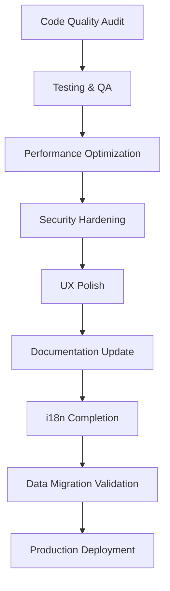

# Design Document

## Overview

This design document outlines the comprehensive approach for preparing Hijraah for production release within one week. The design focuses on systematic cleanup, optimization, and hardening of the immigration platform to ensure production readiness. The approach is structured around eight key areas: code quality, testing, performance, security, user experience, documentation, internationalization, and data integrity.

## Architecture

### Release Preparation Pipeline

The release preparation follows a structured pipeline approach:



### Current System Analysis

Based on the codebase analysis, Hijraah is a sophisticated Next.js 15 application with:

- **Frontend**: React 18 with TypeScript, Tailwind CSS, Shadcn UI
- **Backend**: Supabase (PostgreSQL), Next.js API routes, Hono.js
- **AI Integration**: Multiple providers (OpenAI, Anthropic, Mistral, etc.)
- **Infrastructure**: Vercel deployment, Upstash Redis caching, Sentry monitoring
- **Architecture**: Monorepo with packages, Domain-Driven Design migration in progress

## Components and Interfaces

### 1. Code Quality Management System

**Purpose**: Systematically identify and resolve code quality issues

**Components**:
- **Linting Engine**: ESLint configuration with TypeScript rules
- **Formatting System**: Prettier with consistent code style
- **Type Checker**: TypeScript strict mode validation
- **Dependency Auditor**: Security vulnerability scanner
- **Dead Code Eliminator**: Unused import and code removal

**Interfaces**:
```typescript
interface CodeQualityReport {
  lintingErrors: LintError[];
  typeErrors: TypeScriptError[];
  securityVulnerabilities: SecurityIssue[];
  unusedCode: UnusedCodeItem[];
  formattingIssues: FormattingIssue[];
}

interface QualityMetrics {
  errorCount: number;
  warningCount: number;
  codeComplexity: number;
  testCoverage: number;
}
```

### 2. Testing and Quality Assurance Framework

**Purpose**: Ensure comprehensive test coverage and functionality validation

**Components**:
- **Unit Test Runner**: Jest with React Testing Library
- **Integration Test Suite**: API endpoint testing
- **Authentication Test Suite**: Auth flow validation
- **Database Test Suite**: CRUD operation testing
- **Performance Test Suite**: Load and stress testing

**Current Test Structure**:
- API tests: `__tests__/api/`
- Core logic tests: `__tests__/lib/`
- Security tests: `__tests__/security/`
- Load tests: `__tests__/load/`
- Client tests: `__tests__/client/`

### 3. Performance Optimization Engine

**Purpose**: Optimize application performance for production workloads

**Components**:
- **Bundle Analyzer**: Webpack bundle size optimization
- **Image Optimizer**: Next.js image optimization
- **Cache Manager**: Redis caching strategy
- **Database Query Optimizer**: SQL query performance tuning
- **CDN Configuration**: Static asset delivery optimization

**Performance Targets**:
- Initial page load: < 3 seconds
- Page transitions: < 1 second
- API response time: < 500ms
- Time to Interactive (TTI): < 4 seconds

### 4. Security Hardening System

**Purpose**: Implement comprehensive security measures for production

**Components**:
- **Authentication Validator**: Supabase Auth security review
- **Authorization Checker**: RBAC implementation validation
- **Input Sanitizer**: XSS and injection prevention
- **File Upload Validator**: Secure file handling
- **HTTPS Enforcer**: SSL/TLS configuration

**Security Checklist**:
- Content Security Policy (CSP) headers
- Rate limiting implementation
- Input validation and sanitization
- Secure session management
- File upload restrictions
- API endpoint authorization

### 5. User Experience Polish Framework

**Purpose**: Enhance user interface and interaction quality

**Components**:
- **Form Validator**: Enhanced form validation and error messages
- **Loading State Manager**: Consistent loading indicators
- **Error Handler**: User-friendly error messaging
- **Responsive Design Validator**: Mobile/desktop compatibility
- **Accessibility Checker**: WCAG 2.1 AA compliance

**UX Improvements**:
- Consistent error messaging
- Loading states for all async operations
- Responsive design validation
- Accessibility compliance
- Smooth animations and transitions

### 6. Documentation and Deployment System

**Purpose**: Prepare comprehensive documentation and deployment procedures

**Components**:
- **API Documentation Generator**: OpenAPI/Swagger documentation
- **Environment Configuration Manager**: Production environment setup
- **Migration Script Validator**: Database migration testing
- **Monitoring Setup**: Error tracking and performance monitoring
- **Backup System**: Data backup and recovery procedures

### 7. Internationalization Completion Engine

**Purpose**: Finalize multi-language support

**Components**:
- **Translation Validator**: Missing translation detector
- **Locale Manager**: Language switching functionality
- **RTL Support**: Right-to-left language support
- **Date/Number Formatter**: Locale-specific formatting
- **Translation Sync**: Translation file synchronization

**Current i18n Setup**:
- Next-intl for internationalization
- Languine for translation management
- Support for Arabic (RTL), French, Spanish
- Translation validation scripts

### 8. Data Migration and Integrity System

**Purpose**: Ensure data consistency and migration safety

**Components**:
- **Migration Validator**: Database schema migration testing
- **Data Integrity Checker**: Constraint validation
- **Backup Creator**: Pre-migration data backup
- **Recovery Tester**: Data recovery procedure validation
- **User Data Validator**: Profile and document accessibility

## Data Models

### Release Checklist Model

```typescript
interface ReleaseChecklist {
  id: string;
  category: ReleaseCategory;
  tasks: ReleaseTask[];
  status: 'pending' | 'in_progress' | 'completed' | 'failed';
  priority: 'low' | 'medium' | 'high' | 'critical';
  estimatedHours: number;
  actualHours?: number;
  assignee?: string;
  dependencies: string[];
  completedAt?: Date;
}

interface ReleaseTask {
  id: string;
  title: string;
  description: string;
  status: TaskStatus;
  validationCriteria: string[];
  automationScript?: string;
  manualSteps?: string[];
}

enum ReleaseCategory {
  CODE_QUALITY = 'code_quality',
  TESTING = 'testing',
  PERFORMANCE = 'performance',
  SECURITY = 'security',
  UX_POLISH = 'ux_polish',
  DOCUMENTATION = 'documentation',
  INTERNATIONALIZATION = 'i18n',
  DATA_MIGRATION = 'data_migration'
}
```

### Quality Metrics Model

```typescript
interface QualityMetrics {
  timestamp: Date;
  codeQuality: {
    lintErrors: number;
    typeErrors: number;
    codeComplexity: number;
    testCoverage: number;
  };
  performance: {
    bundleSize: number;
    loadTime: number;
    apiResponseTime: number;
    lighthouseScore: number;
  };
  security: {
    vulnerabilities: SecurityVulnerability[];
    securityScore: number;
  };
  accessibility: {
    wcagCompliance: number;
    accessibilityIssues: AccessibilityIssue[];
  };
}
```

## Error Handling

### Systematic Error Resolution

**Error Categories**:
1. **Build Errors**: TypeScript compilation issues
2. **Runtime Errors**: Application runtime failures
3. **Test Failures**: Broken test cases
4. **Security Issues**: Vulnerability findings
5. **Performance Issues**: Slow loading or response times
6. **UX Issues**: Poor user experience elements

**Error Handling Strategy**:
- Automated error detection and reporting
- Prioritized error resolution based on severity
- Comprehensive error logging with Sentry
- User-friendly error messages in production
- Graceful degradation for non-critical features

### TODO Item Resolution

Based on the codebase analysis, several TODO items need attention:

1. **AI SDK v5 Migration**: Fix middleware exports
2. **Cache Implementation**: Complete caching system after migration
3. **DocumentChunks Table**: Add missing database table
4. **Trigger.dev v3**: Migrate to new tasks API
5. **OpenTelemetry**: Restore full tracing functionality
6. **Authentication Middleware**: Complete API authentication
7. **Stripe Webhooks**: Implement signature verification
8. **GraphQL Types**: Complete type generation

## Testing Strategy

### Comprehensive Test Coverage

**Test Categories**:
1. **Unit Tests**: Component and function testing
2. **Integration Tests**: API endpoint testing
3. **End-to-End Tests**: Complete user workflow testing
4. **Security Tests**: Vulnerability and penetration testing
5. **Performance Tests**: Load and stress testing
6. **Accessibility Tests**: WCAG compliance testing

**Test Execution Plan**:
- Automated test runs on every change
- Manual testing for critical user flows
- Cross-browser compatibility testing
- Mobile device testing
- Performance benchmarking

### Quality Gates

**Pre-Release Criteria**:
- All tests passing (100% pass rate)
- Code coverage > 80%
- No high-severity security vulnerabilities
- Performance benchmarks met
- Accessibility compliance verified
- All TODO items resolved or documented

## Implementation Phases

### Phase 1: Foundation (Days 1-2)
- Code quality audit and cleanup
- Dependency updates and security patches
- Build system optimization
- Test infrastructure validation

### Phase 2: Core Functionality (Days 3-4)
- API testing and validation
- Authentication flow testing
- Database migration testing
- Performance optimization

### Phase 3: User Experience (Days 5-6)
- UI/UX polish and consistency
- Error handling improvements
- Loading state enhancements
- Accessibility compliance

### Phase 4: Production Readiness (Day 7)
- Final security review
- Documentation completion
- Deployment preparation
- Go-live checklist validation

## Success Metrics

**Release Readiness Indicators**:
- Zero critical bugs
- All tests passing
- Performance targets met
- Security audit passed
- Documentation complete
- Deployment pipeline validated
- Monitoring systems active
- Backup procedures tested

**Post-Release Monitoring**:
- Error rate < 0.1%
- Page load time < 3 seconds
- API response time < 500ms
- User satisfaction > 90%
- Zero security incidents
- Uptime > 99.9%