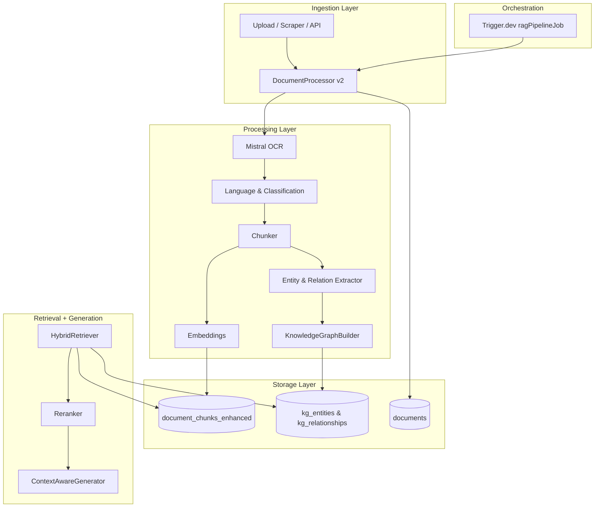

# Consolidated RAG + Document Processing Pipeline Plan

This document replaces **implementation_plan.md** and extends **IMPLEMENTATION_RAG_KG.md** by merging the legacy Document Processing Pipeline with the current Retrieval-Augmented Generation (RAG) + Knowledge Graph (KG) initiative. The goal is to present a single, authoritative roadmap for all ingestion, processing, retrieval, and generation features.

---

## 1. Objectives

1. Unify document ingestion, OCR, classification, embedding, and KG enrichment under one **DocumentProcessor**.
2. Adopt the **Mistral OCR** API via the Vercel AI SDK for superior multilingual text extraction.
3. Decommission legacy endpoints and Trigger.dev jobs that duplicate functionality.
4. Maintain backward compatibility for existing front-end upload flows while enabling new RAG features (hybrid search, graph queries, personalized generation).

---

## 2. High-Level Architecture (Updated)

---

## 3. Task Breakdown

### 3.1 Database & Storage (✅ Done)

- pgvector enabled, tables created (`documents`, `document_chunks_enhanced`, `kg_entities`, `kg_relationships`, etc.).
- Vector & FTS indexes in place.

### 3.2 Document Processing Enhancements (🔄 In Progress)

> **Current Implementation Snapshot**  
> • OCR Endpoint: `src/app/api/documents/ocr/route.ts` – **uses Mistral via Vercel AI SDK** (✅ _implemented_)  
> • Classification Endpoint: `src/app/api/documents/classify/route.ts` – **operational** (✅)  
> • Embedding Endpoint: `src/app/api/embeddings/route.ts` – **operational** (✅)  
> • DocumentProcessor v2: `src/lib/rag/ingestion/document-processor.ts` – scraping, chunking, embeddings (**classification still TODO**)  
> • Trigger.dev job: `src/lib/triggers/rag-pipeline.ts` (_ragPipelineTask_) + legacy `src/jobs/process-document.ts` (**to merge**)  
> • Upload flow: UI components `UnifiedDocumentProcessor.tsx`, `BatchProcessor.tsx` already call `/api/documents/ocr` but **not yet the new pipeline**.

| ID    | Item                                                                                                                       | Owner    | Status  | Notes                                                                              |
| ----- | -------------------------------------------------------------------------------------------------------------------------- | -------- | ------- | ---------------------------------------------------------------------------------- |
| DP-1  | Migrate OCR logic to shared **DocumentProcessor.extractText** so both uploads & scraped docs share the same flow           | Backend  | ✅ Done | implemented in `src/lib/rag/ingestion/document-processor.ts` + `src/lib/ai/ocr.ts` |
| DP-1a | Ensure `/api/documents/ocr` simply proxies to the new utility (maintain external contract)                                 | Backend  | ✅ Done | refactored route in `src/app/api/documents/ocr/route.ts`                           |
| DP-2  | Add `classifyText()` to `DocumentProcessor` that calls internal `/api/documents/classify` (or inline SDK call)             | Backend  | ✅ Done | inline generateObject classification implemented in processor                      |
| DP-3  | Deprecate `/api/documents/classify` & `/api/embeddings` once processor integration is complete; respond `410 Gone`         | Backend  | ✅ Done | LEGACY_DOC_APIS gate added to both routes                                          |
| DP-4  | Update `document.uploaded` Trigger.dev event to invoke **ragPipelineTask** only and remove `process-document.ts` job       | Workflow | ✅ Done | process route now emits event `rag-pipeline-orchestrator`, legacy job removed      |
| DP-5  | Review & adjust RLS for buckets: `documents`, `chat-attachments` to ensure Processor service role access                   | DBA      | 🔜      | deliberate on `storage_admin` role                                                 |
| DP-6  | Migrate front-end upload components to call `/api/documents/process` (or new GraphQL mutation) instead of manual OCR steps | Frontend | 🔜      | affects `UnifiedDocumentProcessor.tsx`, `BatchProcessor.tsx`                       |
| DP-7  | End-to-end tests (Playwright) covering upload → OCR → KG insertion                                                         | QA       | 📝      | create under `tests/e2e/doc_upload.spec.ts`                                        |

### 3.3 Knowledge Graph & Retrieval (🚧 Ongoing)

> _Implemented code lives in_:  
> • Graph builder: `src/lib/rag/knowledge-graph/builder.ts`  
> • Hybrid search: `src/lib/rag/retrieval/hybrid-retriever.ts`  
> • Scheduled maintenance: `src/jobs/performance-tune.ts`, `src/jobs/purge-rag-cache.ts`

- KG-1 (**DONE**): Table & index migrations `supabase/migrations/20240722000000_rag_kg_schema.sql`
- KG-2 (**⏳**): Entity resolution improvements (Levenshtein + embedding-sim) – _branch `kg/entity-resolution`_
- KG-3 (**🔜**): Path-finding SQL (`search_path_kg`) & graph-shortest-path helper
- KG-4 (**🔜**): Incremental embedding refresh job – schedule hourly Trigger.dev task `refresh-kg-embeddings`

### 3.4 API & Frontend Integration (📝 Planned)

| ID    | Item                                                                                  | Notes                                 | Owner    |
| ----- | ------------------------------------------------------------------------------------- | ------------------------------------- | -------- |
| API-1 | Harden `/api/rag/search` & `/api/rag/chat` with auth + rate-limit + observability     | Add Sentry + p75 metrics              | Backend  |
| FE-1  | Upload UI (> `UnifiedDocumentProcessor`) to use new `/api/documents/process` endpoint | Remove local OCR polling              | Frontend |
| FE-2  | Chat UI streaming with citations & KG entity chips                                    | Use `@ai-sdk/react` `useChat` wrapper | Frontend |
| FE-3  | Admin dashboards for KG entities & job runs                                           | Leverage existing `(admin)/` pages    | Frontend |

### 3.5 Deprecation / Cleanup (💣)

1. **Archive** _implementation_plan.md_ (retain for reference, no auto-delete).
2. Remove legacy Trigger.dev task `documentProcessingTask` once migration stable.
3. Delete obsolete Supabase RPC `match_document_chunks` after 30-day traffic audit (replaced by `search_rag_hybrid`).
4. Mark old API routes (`/api/documents/ocr`, `/api/documents/classify`, `/api/embeddings`) with `X-Deprecation` header immediately, then 410 after clients move (DP-3).
5. Purge unused storage objects older than 90 days via nightly job.

---

## 4. Timeline

| Week | Focus                                           |
| ---- | ----------------------------------------------- |
| 1    | DP-1, DP-2 implementation, unit tests           |
| 2    | Trigger.dev migration (DP-4), cleanup DP-3      |
| 3    | KG-2, KG-3 algorithms; update retrieval weights |
| 4    | API-1 stabilization, FE-1 integration           |
| 5    | FE-2 UX polish, accessibility, i18n             |
| 6    | Load & security testing, final cleanup          |

---

## 5. Open Questions

4. Should we auto-backfill KG entities for existing `documents` rows missing classification?
5. Can we switch embedding model to `mistral-embed-plus` (if released) for cost/performance gains?

---

## 6. Definition of Done

- All ingestion traffic flows through **DocumentProcessor v2** and **ragPipelineJob**.
- Legacy endpoints return `410 Gone`.
- RAG search results include citations plus KG entity chips ≥ 95 % of test queries.
- Load test: P90 end-to-end query latency ≤ 2 s with 100 concurrent users.
- Documentation & diagrams updated.

---

## 7. Test Strategy (NEW)

- **Unit Tests**: Jest + Supabase test containers for processor / KG builder.
- **Integration**: Trigger.dev local mode simulating `document.uploaded` events.
- **E2E**: Playwright user flows: upload → chat → citation click-through.
- **Perf**: k6 script in `scripts/load` hitting `/api/rag/search` at 50 rps.

---

> **Next Step:** Assign owners for DP-1…DP-7 and KG-2…KG-4, then kick-off Week 1 tasks.
