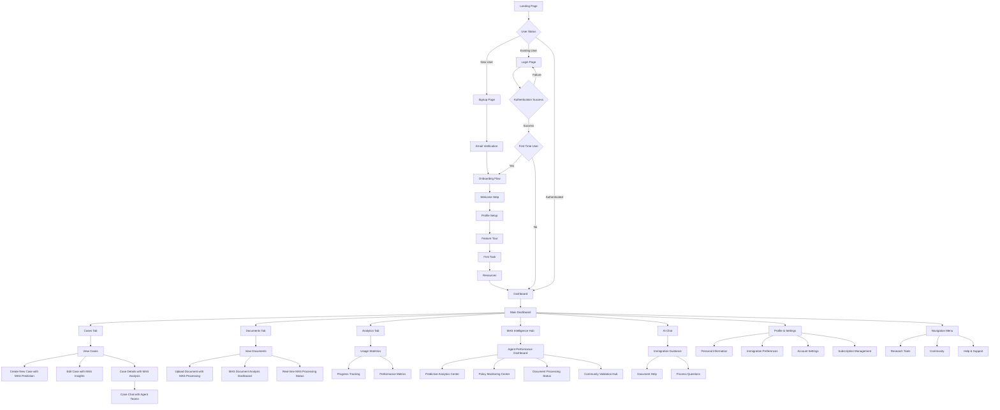

# Hijraah Platform - Complete User Flow Map

## Overview

This document maps out all user journeys in the Hijraah immigration platform, identifying interconnections, potential confusion points, and ensuring smooth user experience.

## User Types & Roles

- **Anonymous Users**: Visitors exploring the platform
- **Registered Users**: Authenticated users managing immigration cases
- **Admin Users**: Platform administrators with elevated permissions

## Complete User Flow Diagram



## Detailed User Journeys

### 1. New User Journey (First-Time Experience)

#### 1.1 Discovery & Landing

- **Entry Point**: Landing page (`/`)
- **Key Elements**: Hero section, features, CTA buttons
- **Actions**:
  - View platform benefits
  - Click "Start Chat" or "Check Eligibility"
  - Click "Get Started" (signup)
  - Access "Dashboard" (existing users)

#### 1.2 Registration Process

- **Page**: Signup (`/signup`)
- **Flow**:
  1. Email/password form OR Google OAuth
  2. Email verification (if email signup)
  3. Account creation confirmation
- **Redirect**: Onboarding flow

#### 1.3 Onboarding Experience

- **Trigger**: Database trigger creates onboarding record
- **Steps**:
  1. **Welcome**: Platform introduction
  2. **Profile Setup**: Personal info, immigration goals
  3. **Feature Tour**: Dashboard walkthrough
  4. **First Task**: Create case or upload document
  5. **Resources**: Access to guides and help
- **Completion**: Redirect to dashboard

### 2. Returning User Journey

#### 2.1 Authentication

- **Page**: Login (`/login`) or direct dashboard access
- **Flow**:
  1. Email/password OR Google OAuth
  2. Session validation via middleware
  3. Redirect to dashboard or intended page

#### 2.2 Dashboard Access

- **Page**: Main dashboard (`/dashboard`)
- **Tabs**: Cases, Documents, Analytics
- **Quick Actions**: Create case, upload document
- **Navigation**: Sidebar with all features

### 3. Core Feature Flows

#### 3.1 Case Management Flow (MAS-Enhanced)

```
Dashboard → Cases Tab → [View/Create/Edit] → MAS Case Analysis → Predictive Insights → Actions
```

- **Create Case**: Form with MAS predictive analytics pre-assessment
- **MAS Case Analysis**:
  - **Timeline Prediction Agent**: Estimated processing time with confidence intervals
  - **Success Probability Agent**: Likelihood of approval with risk factors
  - **Risk Assessment Agent**: Comprehensive risk analysis with mitigation strategies
  - **Cost Estimation Agent**: Detailed cost breakdown with budget planning
  - **Recommendation Agent**: Personalized action plan with priority tasks
- **Predictive Insights Dashboard**: Visual analytics with agent-generated recommendations
- **Smart Actions**: AI-suggested next steps, document requirements, policy alerts

#### 3.2 Document Management Flow (MAS-Enhanced)

```
Dashboard → Documents Tab → [View/Upload/Analyze] → MAS Document Processing → Real-time Analysis → Actions
```

- **Upload Document**: File selection with MAS document classification agent pre-analysis
- **MAS Document Processing**:
  - **Classification Agent**: Automatic document categorization (passport, visa, certificate, etc.)
  - **OCR Processing Agent**: Multi-modal text extraction with confidence scoring
  - **Content Extraction Agent**: Structured field extraction and validation
  - **Quality Validation Agent**: Document quality assessment and issue detection
  - **Translation Agent**: Multi-language document translation (if needed)
- **Real-time Analysis Dashboard**: Live progress tracking with agent confidence scores
- **Document Actions**: Case linking suggestions, validation reports, improvement recommendations

#### 3.3 AI Chat Flow (MAS-Enhanced)

```
Dashboard → Chat → [Topic Selection] → MAS Agent Orchestration → Intelligent Response → Follow-up Actions
```

- **New Chat**: Immigration topic selection with MAS agent team recommendations
- **MAS Agent Orchestration**:
  - **Policy Change Detection Team**: Real-time policy updates and impact analysis
  - **Predictive Analytics Team**: Success probability, timeline, and cost predictions
  - **Document Processing Team**: Document-specific guidance and requirements
  - **Community Validation Team**: Peer-reviewed insights and consensus data
- **Intelligent Response**: Context-aware responses with agent confidence scores and sources
- **Follow-up Actions**: Smart suggestions for case creation, document uploads, policy monitoring

### 4. Administrative Flows

#### 4.1 User Management

- **Access**: Admin dashboard (`/admin`)
- **Features**: User list, permissions, case oversight
- **Actions**: User support, data management

#### 4.2 System Monitoring

- **Analytics**: Usage metrics, performance data
- **Maintenance**: System health, error tracking

## MAS Agent Integration Points

### 1. Multi-Agent System Architecture in User Flows

#### Document Processing Agent Team Integration

- **Upload Flow**: Real-time classification and quality assessment during upload
- **Processing Dashboard**: Live agent progress with confidence scores and validation results
- **Multi-language Support**: Automatic translation with legal term preservation
- **Quality Feedback**: Immediate recommendations for document improvement

#### Predictive Analytics Agent Team Integration

- **Case Creation**: Instant success probability and timeline predictions
- **Risk Dashboard**: Comprehensive risk assessment with mitigation strategies
- **Cost Planning**: Detailed budget breakdown with optimization suggestions
- **Strategic Recommendations**: Personalized action plans with priority ranking

#### Policy Change Detection Agent Team Integration

- **Real-time Monitoring**: Continuous policy change detection and impact analysis
- **Personalized Alerts**: Targeted notifications based on user profile and case status
- **Trend Analysis**: Historical policy patterns and future predictions
- **Cross-jurisdiction Comparison**: Multi-country policy alignment analysis

#### Community Validation Agent Team Integration

- **Peer Review System**: Collaborative validation of user experiences and data
- **Reputation Scoring**: Trust metrics for community contributors
- **Consensus Building**: Democratic decision-making for disputed information
- **Gamification**: Achievement tracking and motivation systems

### 2. Cross-Agent Intelligence Flows

- **Document → Predictive Analytics**: Document quality impacts success probability
- **Policy Changes → Risk Assessment**: New policies trigger risk recalculation
- **Community Data → All Agents**: Peer-reviewed data enhances all predictions
- **User Behavior → Personalization**: Agent responses adapt to user preferences

## Interconnection Points

### 1. MAS-Enhanced Cross-Feature Integration

- **Cases ↔ Documents**: MAS agents provide intelligent linking suggestions and validation
- **Cases ↔ Chat**: Context-aware responses from specialized agent teams
- **Documents ↔ Chat**: Document-specific guidance from processing agents
- **Profile ↔ All Features**: Personalized experience powered by predictive analytics agents
- **Policy Changes ↔ All Features**: Real-time updates from policy monitoring agents

### 2. MAS-Enhanced Data Flow Connections

```
User Profile → MAS Predictive Analytics → Personalized Immigration Strategy
Cases → MAS Risk Assessment → Proactive Mitigation Plans
Documents → MAS Multi-Modal Processing → Intelligent Validation & Translation
Policy Changes → MAS Impact Assessment → Personalized Notifications
Chat History → MAS Agent Context → Specialized Expert Responses
Community Data → MAS Validation Agents → Peer-Reviewed Insights
Cross-Agent Intelligence → Unified Dashboard → Comprehensive Immigration Guidance
```

### 3. Navigation Interconnections

- **Breadcrumb Navigation**: Clear path indication
- **Contextual Links**: Related actions and features
- **Quick Actions**: Cross-feature shortcuts
- **Search Integration**: Global content discovery

## Potential Confusion Points & Solutions

### 1. Onboarding Clarity

**Issue**: Users might skip important setup steps
**Solution**:

- Progressive disclosure of features
- Clear step indicators
- Skip options with consequences explained
- Ability to restart onboarding

### 2. Feature Discovery

**Issue**: Users might not find all available features
**Solution**:

- Prominent feature tour
- Contextual help tooltips
- Feature highlights for new capabilities
- Search functionality

### 3. Case-Document Relationship

**Issue**: Unclear connection between cases and documents
**Solution**:

- Visual linking indicators
- Drag-and-drop document assignment
- Clear case context in document views
- Automatic suggestions for document-case linking

### 4. MAS Agent Context and Transparency

**Issue**: Users might not understand which agents are providing responses and their capabilities
**Solution**:

- **Agent Identification**: Clear indicators showing which agent team is responding
- **Confidence Scoring**: Visual confidence indicators for all agent predictions
- **Source Attribution**: Links to data sources and reasoning behind agent responses
- **Agent Capabilities**: Detailed explanations of each agent team's specialization
- **Processing Transparency**: Real-time visibility into agent workflows and decision-making
- **Human Handoff**: Clear escalation paths when agent confidence is low

### 5. Progress Tracking

**Issue**: Users might lose track of their immigration progress
**Solution**:

- Visual progress indicators
- Timeline views
- Milestone celebrations
- Next-step recommendations

## MAS-Enhanced User Experience

### 1. Intelligent Onboarding with MAS Agents

- **Profile Analysis**: Predictive analytics agents assess user profile for personalized onboarding
- **Document Readiness**: Document processing agents evaluate uploaded documents during setup
- **Risk Assessment**: Early risk identification with mitigation suggestions
- **Success Prediction**: Initial timeline and probability estimates to set expectations

### 2. Real-time Agent Feedback

- **Processing Indicators**: Live updates from document processing agents
- **Confidence Meters**: Visual indicators of agent certainty levels
- **Progress Tracking**: Step-by-step agent workflow visibility
- **Quality Scores**: Immediate feedback on document and case quality

### 3. Proactive Intelligence

- **Policy Alerts**: Automatic notifications from policy monitoring agents
- **Risk Warnings**: Proactive alerts when risk assessment agents detect issues
- **Opportunity Identification**: Agents suggest optimal timing for applications
- **Document Reminders**: Smart reminders based on case timeline predictions

### 4. Collaborative Intelligence

- **Multi-Agent Consensus**: When agents disagree, show different perspectives
- **Community Validation**: Peer-reviewed data integration with agent insights
- **Expert Escalation**: Seamless handoff to human experts when agent confidence is low
- **Learning Feedback**: User feedback improves agent performance over time

## Mobile Experience Considerations

### 1. MAS-Enhanced Mobile Design

- Touch-friendly agent interaction interfaces
- Optimized agent dashboard navigation
- Readable confidence scores and metrics
- Efficient agent-powered data entry

### 2. Mobile-Specific MAS Features

- Camera document capture with instant MAS processing
- Push notifications from policy monitoring agents
- Offline capability with cached agent insights
- Quick actions powered by recommendation agents

## Accessibility & Internationalization

### 1. Accessibility Features

- Screen reader compatibility
- Keyboard navigation
- High contrast options
- Text scaling support

### 2. Multi-Language Support

- Language selection
- RTL support for Arabic
- Localized content
- Cultural considerations

## Error Handling & Recovery

### 1. Common Error Scenarios

- Network connectivity issues
- Authentication failures
- File upload problems
- Form validation errors

### 2. Recovery Mechanisms

- Clear error messages
- Retry options
- Alternative paths
- Help system integration

## Performance Considerations

### 1. Loading States

- Skeleton screens
- Progressive loading
- Optimistic updates
- Background processing

### 2. Caching Strategy

- Static content caching
- API response caching
- User preference caching
- Offline functionality

## Security & Privacy

### 1. Data Protection

- Secure document storage
- Encrypted communications
- Access control
- Audit trails

### 2. User Privacy

- Data usage transparency
- Consent management
- Data export options
- Account deletion

## Success Metrics

### 1. User Engagement

- Onboarding completion rate
- Feature adoption rate
- Session duration
- Return user rate

### 2. Task Completion

- Case creation success
- Document upload success
- Chat interaction quality
- Goal achievement rate

### 3. MAS Agent Performance Metrics

- **Agent Accuracy**: Prediction accuracy vs. actual outcomes
- **User Trust**: User acceptance rate of agent recommendations
- **Processing Efficiency**: Time reduction in document processing and case analysis
- **Proactive Value**: Success rate of proactive agent alerts and suggestions
- **Multi-Agent Coordination**: Effectiveness of agent team collaboration
- **Community Integration**: Quality improvement from community validation agents

### 4. Intelligence-Driven Outcomes

- **Prediction Accuracy**: Timeline and success probability prediction accuracy
- **Risk Mitigation**: Percentage of risks identified and successfully mitigated
- **Cost Optimization**: Average cost savings from agent recommendations
- **Policy Responsiveness**: Time from policy change to user notification
- **Document Quality**: Improvement in document acceptance rates
- **User Satisfaction**: Satisfaction with AI-powered guidance and insights

## Continuous Improvement

### 1. User Feedback

- In-app feedback forms
- User testing sessions
- Analytics insights
- Support ticket analysis

### 2. Iterative Enhancement

- A/B testing framework
- Feature flag system
- Gradual rollouts
- Performance monitoring

## MAS Integration Implementation Status

### ✅ Completed MAS Infrastructure (Backend)

- **Document Processing Agents**: Classification, OCR, extraction, quality validation, translation
- **Predictive Analytics Agents**: Timeline, success probability, risk assessment, cost estimation, recommendations
- **Policy Change Detection Agents**: Monitoring, impact assessment, notifications, trend analysis, cross-jurisdiction
- **Community Validation Agents**: Peer review, reputation scoring, moderation, gamification, consensus
- **API Integration**: MAS-enhanced endpoints with agent processing capabilities
- **Webhook System**: Intelligent routing and payload enrichment with agent insights

### 🚧 Remaining MAS Frontend Integration (High Priority)

- **Task 18.8**: Next.js UI components for agent interaction using AI SDK v5 React integration
- **Task 19.1**: Immigration case analysis interface with MAS predictive analytics
- **Task 19.2**: Document processing interface with MAS multi-modal agents
- **Task 19.3**: Policy monitoring dashboard with MAS policy change detection
- **Task 19.4**: Community validation interface with MAS validation agents

### 🎯 Critical Integration Points for User Experience

1. **Real-time Agent Dashboards**: Live processing status with confidence indicators
2. **Intelligent Recommendations**: Context-aware suggestions throughout user journeys
3. **Proactive Notifications**: Policy alerts and risk warnings from monitoring agents
4. **Transparent AI**: Clear agent attribution and confidence scoring
5. **Collaborative Intelligence**: Seamless integration of community validation with agent insights

### 📋 Next Steps for Complete MAS Integration

1. **Immediate**: Implement Task 18.8 (MAS Frontend Components)
2. **Short-term**: Complete Tasks 19.1-19.4 (User-facing MAS features)
3. **Medium-term**: Performance optimization and advanced monitoring
4. **Long-term**: Advanced personalization and intelligent orchestration

---

This MAS-enhanced user flow map ensures that the sophisticated multi-agent system capabilities are properly integrated into every user journey, providing intelligent, proactive, and transparent AI assistance throughout the immigration process. The comprehensive agent teams work collaboratively to deliver personalized insights, real-time processing, and community-validated guidance that transforms the traditional immigration experience into an intelligent, data-driven journey.
