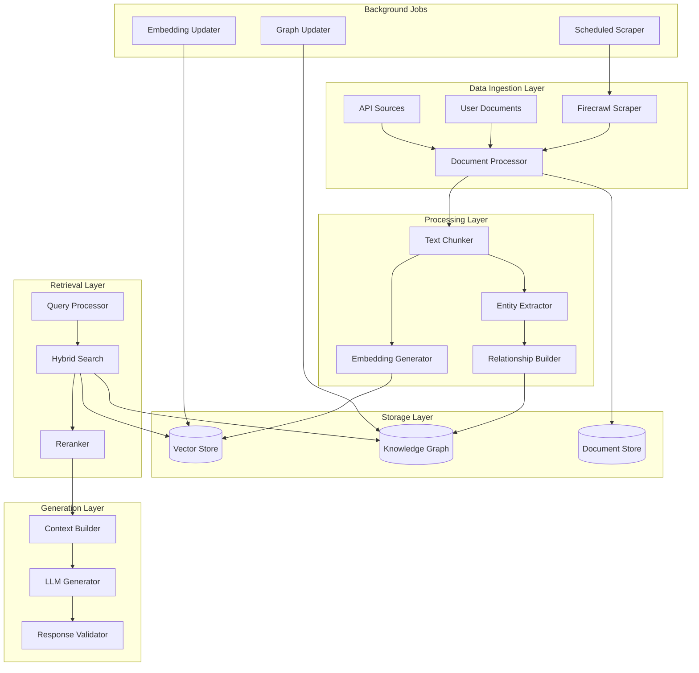

# Hijraah RAG Pipeline with Knowledge Graph Implementation Plan

## Executive Summary

This document outlines the implementation plan for an advanced Retrieval-Augmented Generation (RAG) pipeline with Knowledge Graph capabilities for the Hijraah immigration platform. The system will enhance the existing AI-powered immigration assistance by providing more accurate, contextual, and relationship-aware information retrieval.

## Table of Contents

1. [Overview](#overview)
2. [Architecture](#architecture)
3. [Database Schema](#database-schema)
4. [Core Components](#core-components)
5. [Implementation Phases](#implementation-phases)
6. [Technical Specifications](#technical-specifications)
7. [Integration Points](#integration-points)
8. [Testing Strategy](#testing-strategy)
9. [Performance Considerations](#performance-considerations)

## Overview

### Goals

1. **Enhanced Information Retrieval**: Improve the accuracy and relevance of immigration information retrieval
2. **Relationship Awareness**: Understand connections between immigration concepts, policies, and requirements
3. **Temporal Intelligence**: Track policy changes and updates over time
4. **Multi-source Integration**: Combine information from official sources, documents, and community knowledge
5. **Personalized Recommendations**: Provide user-specific guidance based on their immigration journey

### Tech Stack

- **Database**: Supabase (PostgreSQL with pgvector extension)
- **AI/ML**: Vercel AI SDK, OpenAI, Custom models
- **Web Scraping**: Firecrawl
- **Background Jobs**: Trigger.dev
- **Vector Search**: pgvector with custom indexing
- **Knowledge Graph**: Neo4j-style relationships in PostgreSQL

## Architecture



## Database Schema

### New Tables

```sql
-- Knowledge Graph Entities
CREATE TABLE IF NOT EXISTS public.kg_entities (
    id UUID PRIMARY KEY DEFAULT gen_random_uuid(),
    entity_type VARCHAR(50) NOT NULL, -- 'country', 'visa_type', 'requirement', 'document', 'program'
    entity_name VARCHAR(255) NOT NULL,
    display_name VARCHAR(255),
    properties JSONB DEFAULT '{}',
    embedding vector(1536), -- For semantic similarity of entities
    created_at TIMESTAMPTZ DEFAULT NOW(),
    updated_at TIMESTAMPTZ DEFAULT NOW(),
    source_references JSONB DEFAULT '[]', -- Array of source document IDs
    confidence_score FLOAT DEFAULT 1.0,
    is_active BOOLEAN DEFAULT true
);

-- Knowledge Graph Relationships
CREATE TABLE IF NOT EXISTS public.kg_relationships (
    id UUID PRIMARY KEY DEFAULT gen_random_uuid(),
    source_entity_id UUID NOT NULL REFERENCES kg_entities(id) ON DELETE CASCADE,
    target_entity_id UUID NOT NULL REFERENCES kg_entities(id) ON DELETE CASCADE,
    relationship_type VARCHAR(50) NOT NULL, -- 'requires', 'leads_to', 'excludes', 'related_to'
    properties JSONB DEFAULT '{}',
    strength FLOAT DEFAULT 1.0, -- Relationship strength/confidence
    temporal_validity JSONB DEFAULT '{}', -- Valid from/to dates
    created_at TIMESTAMPTZ DEFAULT NOW(),
    updated_at TIMESTAMPTZ DEFAULT NOW(),
    source_references JSONB DEFAULT '[]'
);

-- Enhanced Document Chunks with Entity Links
CREATE TABLE IF NOT EXISTS public.document_chunks_enhanced (
    id UUID PRIMARY KEY DEFAULT gen_random_uuid(),
    document_id UUID NOT NULL REFERENCES documents(id) ON DELETE CASCADE,
    chunk_index INTEGER NOT NULL,
    text_content TEXT NOT NULL,
    embedding vector(1536),
    token_count INTEGER,
    entities JSONB DEFAULT '[]', -- Extracted entities with positions
    key_phrases JSONB DEFAULT '[]',
    language VARCHAR(10) DEFAULT 'en',
    chunk_metadata JSONB DEFAULT '{}',
    created_at TIMESTAMPTZ DEFAULT NOW(),
    UNIQUE(document_id, chunk_index)
);

-- RAG Query Cache
CREATE TABLE IF NOT EXISTS public.rag_query_cache (
    id UUID PRIMARY KEY DEFAULT gen_random_uuid(),
    query_hash VARCHAR(64) NOT NULL, -- SHA-256 of normalized query
    query_text TEXT NOT NULL,
    query_embedding vector(1536),
    retrieved_chunks JSONB NOT NULL, -- Array of chunk IDs with scores
    kg_entities JSONB NOT NULL, -- Related knowledge graph entities
    response_metadata JSONB DEFAULT '{}',
    created_at TIMESTAMPTZ DEFAULT NOW(),
    expires_at TIMESTAMPTZ,
    hit_count INTEGER DEFAULT 0,
    INDEX idx_query_hash (query_hash)
);

-- Immigration Policy Timeline
CREATE TABLE IF NOT EXISTS public.policy_timeline (
    id UUID PRIMARY KEY DEFAULT gen_random_uuid(),
    entity_id UUID REFERENCES kg_entities(id),
    policy_type VARCHAR(100) NOT NULL,
    country_code VARCHAR(3),
    effective_date DATE NOT NULL,
    expiry_date DATE,
    description TEXT,
    changes JSONB DEFAULT '{}',
    source_url TEXT,
    scraped_at TIMESTAMPTZ DEFAULT NOW(),
    created_at TIMESTAMPTZ DEFAULT NOW()
);

-- User Query History with Feedback
CREATE TABLE IF NOT EXISTS public.user_query_history (
    id UUID PRIMARY KEY DEFAULT gen_random_uuid(),
    user_id UUID NOT NULL REFERENCES auth.users(id),
    query_text TEXT NOT NULL,
    query_embedding vector(1536),
    response TEXT,
    sources_used JSONB DEFAULT '[]',
    feedback_score INTEGER, -- 1-5 rating
    feedback_text TEXT,
    query_metadata JSONB DEFAULT '{}',
    created_at TIMESTAMPTZ DEFAULT NOW()
);
```

### Indexes and Functions

```sql
-- Vector similarity search indexes
CREATE INDEX idx_kg_entities_embedding ON kg_entities
    USING ivfflat (embedding vector_cosine_ops) WITH (lists = 100);

CREATE INDEX idx_chunks_enhanced_embedding ON document_chunks_enhanced
    USING ivfflat (embedding vector_cosine_ops) WITH (lists = 200);

-- Entity type indexes
CREATE INDEX idx_kg_entities_type ON kg_entities(entity_type);
CREATE INDEX idx_kg_relationships_type ON kg_relationships(relationship_type);

-- Temporal indexes
CREATE INDEX idx_policy_timeline_dates ON policy_timeline(effective_date, expiry_date);

-- Full-text search
CREATE INDEX idx_entities_search ON kg_entities
    USING gin(to_tsvector('english', entity_name || ' ' || display_name));

-- Function for hybrid search
CREATE OR REPLACE FUNCTION search_rag_hybrid(
    query_embedding vector(1536),
    query_text TEXT,
    match_count INT DEFAULT 10,
    similarity_threshold FLOAT DEFAULT 0.7
)
RETURNS TABLE (
    chunk_id UUID,
    document_id UUID,
    content TEXT,
    vector_similarity FLOAT,
    text_rank FLOAT,
    entities JSONB,
    final_score FLOAT
) AS $$
BEGIN
    RETURN QUERY
    WITH vector_search AS (
        SELECT
            c.id,
            c.document_id,
            c.text_content,
            1 - (c.embedding <=> query_embedding) AS similarity,
            c.entities
        FROM document_chunks_enhanced c
        WHERE 1 - (c.embedding <=> query_embedding) > similarity_threshold
        ORDER BY similarity DESC
        LIMIT match_count * 2
    ),
    text_search AS (
        SELECT
            c.id,
            ts_rank(to_tsvector('english', c.text_content),
                   plainto_tsquery('english', query_text)) AS rank
        FROM document_chunks_enhanced c
        WHERE to_tsvector('english', c.text_content) @@
              plainto_tsquery('english', query_text)
        LIMIT match_count * 2
    )
    SELECT
        v.id,
        v.document_id,
        v.text_content,
        v.similarity,
        COALESCE(t.rank, 0) AS text_rank,
        v.entities,
        (v.similarity * 0.7 + COALESCE(t.rank, 0) * 0.3) AS final_score
    FROM vector_search v
    LEFT JOIN text_search t ON v.id = t.id
    ORDER BY final_score DESC
    LIMIT match_count;
END;
$$ LANGUAGE plpgsql;
```

## Core Components

### 1. Document Ingestion Pipeline

```typescript
// src/lib/rag/ingestion/document-processor.ts
export class DocumentProcessor {
  async processDocument(document: Document): Promise<ProcessedDocument> {
    // 1. Extract text content
    const text = await this.extractText(document);

    // 2. Detect language
    const language = await this.detectLanguage(text);

    // 3. Chunk text intelligently
    const chunks = await this.chunkText(text, {
      maxChunkSize: 1000,
      overlapSize: 200,
      preserveSentences: true,
    });

    // 4. Extract entities and relationships
    const entities = await this.extractEntities(chunks);
    const relationships = await this.extractRelationships(entities);

    // 5. Generate embeddings
    const embeddings = await this.generateEmbeddings(chunks);

    // 6. Store in database
    await this.storeProcessedData({
      chunks,
      entities,
      relationships,
      embeddings,
    });

    return { documentId: document.id, status: "processed" };
  }
}
```

### 2. Knowledge Graph Builder

```typescript
// src/lib/rag/knowledge-graph/builder.ts
export class KnowledgeGraphBuilder {
  async buildFromDocument(document: ProcessedDocument): Promise<void> {
    // 1. Create or update entities
    for (const entity of document.entities) {
      await this.upsertEntity(entity);
    }

    // 2. Create relationships
    for (const relationship of document.relationships) {
      await this.createRelationship(relationship);
    }

    // 3. Update temporal information
    await this.updateTemporalData(document);

    // 4. Recalculate graph metrics
    await this.updateGraphMetrics();
  }

  async queryPath(
    startEntity: string,
    endEntity: string,
    maxDepth: number = 3,
  ): Promise<GraphPath[]> {
    // Implement path finding algorithm
    return this.findShortestPaths(startEntity, endEntity, maxDepth);
  }
}
```

### 3. Hybrid Retrieval System

```typescript
// src/lib/rag/retrieval/hybrid-retriever.ts
export class HybridRetriever {
  async retrieve(
    query: string,
    options: RetrievalOptions,
  ): Promise<RetrievalResult> {
    // 1. Generate query embedding
    const embedding = await this.generateQueryEmbedding(query);

    // 2. Perform vector search
    const vectorResults = await this.vectorSearch(embedding, options);

    // 3. Perform keyword search
    const keywordResults = await this.keywordSearch(query, options);

    // 4. Query knowledge graph
    const graphResults = await this.graphSearch(query, options);

    // 5. Merge and rerank results
    const mergedResults = await this.mergeResults({
      vector: vectorResults,
      keyword: keywordResults,
      graph: graphResults,
    });

    // 6. Apply reranking model
    const rerankedResults = await this.rerank(mergedResults, query);

    return {
      chunks: rerankedResults,
      metadata: {
        queryEmbedding: embedding,
        totalResults: rerankedResults.length,
      },
    };
  }
}
```

### 4. Context-Aware Generator

**Note:** The previous non-streaming `ContextAwareGenerator` and a parallel streaming implementation have been consolidated into a single, robust generator located at `src/lib/rag/generation/context-generator.ts`.

The new implementation uses the Vercel AI SDK to provide a streaming response while performing post-processing (validation, citation extraction) after the stream completes.

```typescript
// src/lib/rag/generation/context-generator.ts
import { createOpenAI } from "@ai-sdk/openai";
import { streamText, StreamData } from "ai";

export class ContextAwareGenerator {
  private llm;

  constructor(apiKey?: string) {
    this.llm = createOpenAI({ apiKey });
  }

  /**
   * Generates a streaming data response that includes post-processing.
   * - Builds a detailed context from chunks, KG, and user profile.
   * - Streams the raw LLM response for immediate UI feedback.
   * - In an `onFinish` callback, validates the response, extracts
   *   citations, and appends the final structured data to the stream.
   */
  async generate(
    query: string,
    retrievedContext: RetrievalResult,
    userContext: UserContext,
  ) {
    const data = new StreamData();

    // Immediately send retrieved sources to the client
    data.append(JSON.parse(JSON.stringify({ retrievedContext })));

    const result = await streamText({
      model: this.llm("gpt-4o"),
      // ... (messages and prompts setup from private methods)
      onFinish: async (completion) => {
        // ... (validation, citation, confidence scoring)
        const finalResponse: GeneratedResponse = {
          /* ... */
        };
        data.append(JSON.parse(JSON.stringify(finalResponse)));
        data.close();
      },
    });

    // Returns a ReadableStream in the Vercel AI format
    return result.toDataStreamResponse();
  }
}
```

## Implementation Phases

### Phase 1: Foundation (Week 1-2)

**Status: ✅ Completed**

1.  **Database Setup** - **DONE**

    - Created new tables (`kg_entities`, `kg_relationships`, `document_chunks_enhanced`, etc.) and indexes.
    - Created `search_rag_hybrid` function for combined vector and text search.
    - Migration file: `supabase/migrations/20240722000000_rag_kg_schema.sql`

2.  **Basic Ingestion Pipeline** - **DONE**

    - `DocumentProcessor` implemented in `src/lib/rag/ingestion/document-processor.ts`. It handles scraping, chunking, and basic processing.
    - Using Firecrawl for scraping and `RecursiveCharacterTextSplitter` for chunking.

3.  **Simple Retrieval** - **DONE**
    - `HybridRetriever` implemented in `src/lib/rag/retrieval/hybrid-retriever.ts`.
    - It uses the `search_rag_hybrid` database function for efficient retrieval.

### Phase 2: Knowledge Graph (Week 3-4)

**Status: ⏳ In Progress**

1.  **Entity and Relationship Extraction** - **In Progress**

    - `KnowledgeGraphBuilder` implemented in `src/lib/rag/knowledge-graph/builder.ts`.
    - Currently uses OpenAI's function calling for entity and relationship extraction.
    - Confidence scoring to be added.

2.  **Graph Construction** - **In Progress**

    - Logic for upserting entities and relationships into Supabase tables is implemented in `KnowledgeGraphBuilder`.
    - Entity resolution needs to be refined.
    - Temporal tracking to be implemented.

3.  **Graph Queries** - **To-Do**
    - Path finding algorithms.
    - Subgraph extraction for context building.
    - Entity similarity searches.

### Phase 3: Advanced Features (Week 5-6)

**Status: ⏳ In Progress**

1. **Context-Aware Generation** - **DONE**
   - Implemented a unified `ContextAwareGenerator` using the Vercel AI SDK.
   - Supports streaming responses for real-time UI.
   - Includes post-processing for validation and citation extraction.
2. **Hybrid Search**

   - Query understanding **DONE**
   - Advanced reranking **DONE** (OpenAI-based reranker)
   - Multi-modal retrieval **DONE** (ImageRetriever + CLIP embeddings)

3. **Personalization** – **DONE (basic)**

   - User profile integration **DONE** (country-of-interest prioritization)
   - Query history analysis **DONE** (history-based boost)
   - Preference learning **DONE** (feedback-based weighting)

4. **Caching and Optimization**
   - Query result caching **DONE**
   - Embedding cache **DONE**
   - **Cache eviction job – DONE** (see `src/jobs/purge-rag-cache.ts`)
   - Performance tuning **DONE** (daily ANALYZE & pg_prewarm job)

### Phase 4: Integration and Testing (Week 7-8)

**Status: ⏳ In Progress**

1.  **API Development** - **To-Do**

    - RESTful endpoints for search.
    - GraphQL integration.

2.  **UI Integration** - **To-Do**

    - Search interface.
    - Knowledge graph visualization.

3.  **Testing and Validation** - **To-Do**

    - Unit and integration tests for all new components.

4.  **Trigger.dev Job** - **DONE**
    - A job in `src/jobs/process-document.ts` orchestrates the entire pipeline from document URL to KG insertion.

## Technical Specifications

### Embedding Models

```typescript
// Embedding configuration
export const EMBEDDING_CONFIG = {
  model: "text-embedding-3-large",
  dimensions: 1536,
  batchSize: 100,
  maxRetries: 3,
};
```

### Chunking Strategy

```typescript
// Intelligent chunking with semantic boundaries
export const CHUNKING_CONFIG = {
  maxChunkSize: 1000,
  minChunkSize: 200,
  overlapSize: 200,
  splitOn: ["\\n\\n", ". ", "\\n", " "],
  preserveHeaders: true,
  preserveLists: true,
};
```

### Knowledge Graph Schema

```typescript
// Entity types
export enum EntityType {
  COUNTRY = "country",
  VISA_TYPE = "visa_type",
  REQUIREMENT = "requirement",
  DOCUMENT = "document",
  PROGRAM = "program",
  TIMELINE = "timeline",
  FEE = "fee",
  ELIGIBILITY = "eligibility",
}

// Relationship types
export enum RelationshipType {
  REQUIRES = "requires",
  LEADS_TO = "leads_to",
  EXCLUDES = "excludes",
  RELATED_TO = "related_to",
  SUPERSEDES = "supersedes",
  VALID_FOR = "valid_for",
}
```

## Integration Points

### 1. Trigger.dev Jobs

```typescript
// src/lib/triggers/rag-pipeline.ts
export const ragPipelineJob = task({
  id: "rag-pipeline-processor",
  run: async (payload: { documentId: string }) => {
    const processor = new DocumentProcessor();
    const graphBuilder = new KnowledgeGraphBuilder();

    // Process document
    const processed = await processor.processDocument(payload.documentId);

    // Build knowledge graph
    await graphBuilder.buildFromDocument(processed);

    // Update search indexes
    await updateSearchIndexes(processed);

    return { status: "completed", documentId: payload.documentId };
  },
});

// Scheduled scraping job
export const scheduledScrapingJob = task({
  id: "scheduled-immigration-scraper",
  schedule: "0 */6 * * *", // Every 6 hours
  run: async () => {
    const scraper = new ImmigrationScraper();
    const sources = await getActiveScrapingSources();

    for (const source of sources) {
      await scraper.scrapeSource(source);
    }

    return { status: "completed", sourcesScraped: sources.length };
  },
});
```

### 2. API Endpoints

```typescript
// src/app/api/rag/search/route.ts
import { ContextAwareGenerator } from "@/lib/rag/generation/context-generator";
import { HybridRetriever } from "@/lib/rag/retrieval/hybrid-retriever";
import { getUserContext } from "@/lib/auth/utils"; // Assuming a utility to get user context

export async function POST(request: Request) {
  const { query, filters, options } = await request.json();
  const userContext = await getUserContext(request);

  const retriever = new HybridRetriever();
  const generator = new ContextAwareGenerator();

  // 1. Retrieve relevant context
  const context = await retriever.retrieve(query, { ...options, filters });

  // 2. Generate a streaming data response
  // This returns a ReadableStream with AI SDK's data protocol
  return generator.generate(query, context, userContext);
}
```

### 3. Supabase Edge Functions
