# Hijraah - AI-Powered Immigration Consultant

> Advanced multi-agent AI system for immigration guidance using cutting-edge RAG, multi-provider AI integration, and real-time processing.

<div align="center">

[](https://www.typescriptlang.org/)
[](https://nextjs.org/)
[](https://openai.com/)
[](https://anthropic.com/)
[](https://supabase.com/)

</div>

## 🚀 **Key Features**

### **🤖 Multi-Agent System (MAS)**
- **Specialized AI Agents:** Document analyzer, query router, workflow orchestrator, case manager
- **Intelligent Coordination:** Inter-agent communication with shared knowledge base
- **Fallback Mechanisms:** Agent redundancy and automatic task reassignment

### **🧠 Advanced AI Integration**
- **6 AI Providers:** OpenAI, Anthropic (Claude), Google Gemini, DeepSeek, Fireworks, Mistral
- **Smart Model Selection:** Automatic routing based on task complexity and cost optimization
- **99.9% Uptime:** Intelligent failover with <2s recovery time

### **🔍 Hybrid RAG Pipeline**
- **Multi-Modal Search:** Dense vectors + Sparse vectors + Knowledge graph traversal
- **Performance:** <500ms cached queries, <2s complex searches
- **Personalization:** 85%+ relevance improvement with user profile-based ranking
- **Knowledge Graph:** 15+ entity types, 1000+ relationships with temporal reasoning

### **⚡ Real-Time Features**
- **Streaming Chat:** WebSocket + SSE for real-time AI responses
- **Chain-of-Thought:** Visible AI reasoning process with step-by-step explanations
- **Background Jobs:** Trigger.dev integration with 7 automated workflows
- **Live Analytics:** Real-time performance monitoring and anomaly detection

## 🏗️ **Architecture Overview**

Hijraah implements a sophisticated microservices-inspired architecture within a monorepo structure, featuring advanced AI orchestration, multi-layered caching, intelligent routing, and comprehensive security measures.

### **🔥 High-Level System Architecture**

```mermaid
graph TB
    subgraph "🌐 Client Layer"
        UI["Next.js 15 UI<br/>React 19 + TypeScript<br/>Tailwind + Radix UI"]
        PWA["Progressive Web App<br/>Service Workers<br/>Offline Support"]
        SSE["Server-Sent Events<br/>WebSocket Connections<br/>Real-time Updates"]
    end

    subgraph "🛡️ Security & Guardrails Layer"
        IG["Input Guardrails<br/>Prompt Injection Protection<br/>Content Filtering"]
        OG["Output Guardrails<br/>Bias Detection<br/>Content Sanitization"]
        Auth["Supabase Auth<br/>RLS Policies<br/>JWT Validation"]
        PS["Prompt Shield<br/>AI Safety Monitoring<br/>Rate Limiting"]
    end

    subgraph "🚪 API Gateway & Routing"
        Gateway["Hono.js API Gateway<br/>GraphQL Yoga<br/>OpenAPI Specs"]
        Router["Smart Request Router<br/>Load Balancing<br/>Circuit Breakers"]
        Middleware["Auth Middleware<br/>CORS Handling<br/>Request Validation"]
    end

    subgraph "🤖 Multi-Agent Orchestration Layer"
        MAS["Multi-Agent System<br/>Coordinator"]
        
        subgraph "Specialized Agent Teams"
            DocTeam["📄 Document Processing Team<br/>• Classification Agent<br/>• OCR Agent<br/>• Quality Validation<br/>• Content Extraction<br/>• Translation Agent"]
            PolicyTeam["⚖️ Policy Compliance Team<br/>• Legal Analysis Agent<br/>• Requirement Checker<br/>• Compliance Validator<br/>• Risk Assessor"]
            CaseTeam["📋 Case Management Team<br/>• Case Analyzer<br/>• Timeline Predictor<br/>• Decision Maker<br/>• Progress Tracker"]
            QueryTeam["🔍 Query Processing Team<br/>• Intent Classifier<br/>• Context Builder<br/>• Response Generator<br/>• Quality Checker"]
        end

        Orchestrator["Agent Orchestrator<br/>Task Distribution<br/>Result Aggregation<br/>Workflow Management"]
    end

    subgraph "🧠 AI Provider Layer"
        ModelMux["AI Model Multiplexer<br/>Intelligent Routing<br/>Cost Optimization<br/>Failover Management"]
        
        subgraph "AI Providers"
            OpenAI["OpenAI<br/>GPT-4o/4o-mini<br/>Embeddings<br/>Vision"]
            Anthropic["Anthropic<br/>Claude 3.5 Sonnet<br/>Claude 3 Haiku<br/>High Context"]
            Google["Google AI<br/>Gemini 1.5 Pro/Flash<br/>Multimodal<br/>Long Context"]
            Others["Mistral • DeepSeek<br/>Fireworks • Groq<br/>Specialized Models"]
        end
    end

    subgraph "💾 Advanced Caching Layer"
        Redis["Redis Cache<br/>Session Management<br/>Real-time Data"]
        
        subgraph "Multi-Level Cache"
            L1["L1: Exact Match Cache<br/>Query Fingerprinting<br/>Instant Responses"]
            L2["L2: Semantic Cache<br/>Vector Similarity<br/>Context Awareness"]
            L3["L3: Template Cache<br/>Pattern Matching<br/>Dynamic Rendering"]
            Proactive["Proactive Cache<br/>Predictive Loading<br/>Background Refresh"]
        end
        
        Vector["Vector Cache<br/>Upstash Vector<br/>Semantic Search<br/>Embedding Storage"]
    end

    subgraph "📊 Hybrid RAG & Knowledge System"
        RAG["Advanced RAG Pipeline<br/>Agentic RAG<br/>Multi-Modal Search"]
        
        subgraph "Knowledge Infrastructure"
            VectorDB["Vector Database<br/>pgvector + Pinecone<br/>Dense Embeddings<br/>Semantic Search"]
            KG["Knowledge Graph<br/>Entity Relationships<br/>Temporal Reasoning<br/>Policy Connections"]
            FullText["Full-Text Search<br/>PostgreSQL FTS<br/>Fuzzy Matching<br/>Faceted Search"]
        end
        
        EntityEngine["Entity Extraction<br/>NER Pipeline<br/>Relationship Mapping<br/>Temporal Updates"]
    end

    subgraph "🗄️ Data & Persistence Layer"
        Primary["Supabase PostgreSQL<br/>ACID Compliance<br/>Row Level Security<br/>Real-time Subscriptions"]
        
        subgraph "Specialized Storage"
            Documents["Document Store<br/>Binary Storage<br/>Version Control<br/>Metadata Index"]
            Analytics["Analytics DB<br/>Time-series Data<br/>Performance Metrics<br/>User Behavior"]
            Audit["Audit Logs<br/>Compliance Tracking<br/>Security Events<br/>Change History"]
        end
    end

    subgraph "⚡ Background Processing"
        TriggerDev["Trigger.dev v4<br/>Workflow Orchestration<br/>Scheduled Tasks<br/>Event Processing"]
        
        subgraph "Background Jobs"
            DocProcessing["Document Processing<br/>OCR Pipeline<br/>Content Analysis<br/>Quality Validation"]
            EmbedGen["Embedding Generation<br/>Vector Updates<br/>Index Maintenance<br/>Similarity Computation"]
            PolicyMonitor["Policy Monitoring<br/>Change Detection<br/>Impact Analysis<br/>Notification System"]
            Analytics["Analytics Processing<br/>Usage Metrics<br/>Performance Analysis<br/>Anomaly Detection"]
        end
    end

    subgraph "📡 External Integrations"
        Firecrawl["Firecrawl<br/>Web Scraping<br/>Policy Updates<br/>Data Acquisition"]
        Monitoring["Sentry Monitoring<br/>Error Tracking<br/>Performance APM<br/>User Analytics"]
        CDN["Vercel CDN<br/>Edge Functions<br/>Global Distribution<br/>Static Assets"]
    end

    %% Connections
    UI --> Auth
    UI --> Gateway
    PWA --> SSE
    
    Auth --> IG
    IG --> Gateway
    OG --> UI
    PS --> ModelMux
    
    Gateway --> Router
    Router --> MAS
    Middleware --> Gateway
    
    MAS --> DocTeam
    MAS --> PolicyTeam
    MAS --> CaseTeam
    MAS --> QueryTeam
    MAS --> Orchestrator
    
    Orchestrator --> ModelMux
    ModelMux --> OpenAI
    ModelMux --> Anthropic
    ModelMux --> Google
    ModelMux --> Others
    
    MAS --> L1
    MAS --> L2
    MAS --> L3
    MAS --> Proactive
    Redis --> Vector
    
    MAS --> RAG
    RAG --> VectorDB
    RAG --> KG
    RAG --> FullText
    RAG --> EntityEngine
    
    RAG --> Primary
    Primary --> Documents
    Primary --> Analytics
    Primary --> Audit
    
    TriggerDev --> DocProcessing
    TriggerDev --> EmbedGen
    TriggerDev --> PolicyMonitor
    TriggerDev --> Analytics
    
    DocProcessing --> Primary
    EmbedGen --> VectorDB
    PolicyMonitor --> Firecrawl
    
    Gateway --> Monitoring
    UI --> CDN
```



### **🎯 Core Architecture Principles**

#### **1. Domain-Driven Design (DDD)**
- **Bounded Contexts**: Clear separation between immigration, documents, chat, and admin domains
- **Aggregate Patterns**: Consistent data modeling with proper boundaries
- **Event-Driven Architecture**: Domain events for cross-context communication

#### **2. Microservices-Inspired Monorepo**
- **Package-Based Architecture**: 12 specialized packages with clear responsibilities
- **Shared Libraries**: Common utilities, types, and configurations
- **Independent Deployment**: Packages can be deployed and scaled independently

#### **3. AI-First Design**
- **Multi-Agent Coordination**: Specialized agents for different immigration tasks
- **Intelligent Routing**: AI-powered request routing and model selection
- **Adaptive Learning**: System improves based on user interactions and feedback

### **📦 Package Architecture**


### **🔄 Data Flow Architecture**

#### **User Interaction Flow**
1. **Request Reception**: Next.js API routes receive user requests
2. **Authentication**: Supabase Auth validates user permissions
3. **Input Validation**: Security guardrails check for malicious content
4. **Agent Routing**: Multi-Agent System determines appropriate agent team
5. **Processing**: Specialized agents process the request using AI providers
6. **RAG Enhancement**: Knowledge retrieval enhances AI responses
7. **Output Validation**: Content filtering ensures safe responses
8. **Caching**: Results cached at multiple levels for performance
9. **Response Delivery**: Real-time streaming back to user interface

#### **Background Processing Flow**
1. **Event Trigger**: User actions or scheduled tasks trigger background jobs
2. **Job Queue**: Trigger.dev manages job orchestration and execution
3. **Document Processing**: AI-powered analysis and content extraction
4. **Knowledge Updates**: Vector embeddings and knowledge graph updates
5. **Policy Monitoring**: Automated tracking of immigration policy changes
6. **Analytics**: Performance metrics and user behavior analysis

### **🚀 Advanced Features**

#### **Real-Time Capabilities**
- **WebSocket Connections**: Instant bidirectional communication
- **Server-Sent Events**: Streaming AI responses with reasoning visibility
- **Live Collaboration**: Multi-user document processing and case management
- **Progressive Updates**: Incremental loading and real-time synchronization

#### **AI Optimization**
- **Smart Model Selection**: Cost and performance optimized AI routing
- **Prompt Engineering**: Context-aware prompt optimization
- **Chain-of-Thought**: Visible AI reasoning for transparency
- **Multi-Modal Processing**: Text, image, and document understanding

#### **Performance Engineering**
- **Edge Computing**: Vercel Edge Functions for global low-latency
- **Intelligent Caching**: Multi-layer semantic and exact match caching
- **Database Optimization**: Query optimization and connection pooling
- **CDN Integration**: Global asset distribution and edge caching

## 🛠️ **Tech Stack**

### **Frontend**
- **React 19** with **Next.js 15** - Modern UI framework with server components
- **TypeScript** - Type-safe development with 100% coverage
- **Tailwind CSS** - Utility-first styling with custom design system
- **Radix UI** - Accessible component primitives

### **Backend**
- **Node.js** with **Hono.js** - High-performance API framework
- **GraphQL** with **Yoga** - Type-safe API with code generation
- **PostgreSQL** with **pgvector** - Vector embeddings and full-text search
- **Redis** - Multi-level caching and session management

### **AI/ML Stack**
- **Multi-Provider Integration** - 6 AI providers with intelligent routing
- **LangChain** - Document processing and agent workflows
- **OpenAI Embeddings** - Dense vector representations
- **Knowledge Graphs** - Entity relationships and temporal reasoning

### **Infrastructure**
- **Vercel** - Frontend deployment and edge functions
- **Supabase** - Database, authentication, and real-time features
- **Upstash** - Redis caching and vector storage
- **Trigger.dev** - Background job processing and workflows

## 📊 **Performance Metrics**

| Metric | Achievement | Industry Standard |
|--------|-------------|------------------|
| **Response Time** | <500ms (cached) | <1s |
| **Complex Queries** | <2s | <5s |
| **Uptime** | 99.9% | 99.5% |
| **Test Coverage** | 95%+ | 80%+ |
| **Search Accuracy** | 85%+ improvement | 60%+ |
| **Cache Hit Rate** | >80% (L1), >60% (L2) | >70% |

## 🔬 **AI-Powered Development Workflow**

### **Automated Testing Suite**
- **4 Testing Environments:** API, Core, Security, Load testing
- **AI-Generated Test Cases:** OpenAI-powered mock generation and edge case discovery
- **95%+ Code Coverage:** Comprehensive testing across all system components
- **Edge Case Analysis:** GPT-4 analysis of 1000+ queries for robust test scenarios

### **AI-Generated Documentation**
- **800+ Pages:** Comprehensive documentation generated and maintained by AI
- **Auto-Updated:** Documentation stays current with code changes
- **API Specifications:** OpenAPI docs with intelligent example generation
- **Migration Guides:** Step-by-step guides for system updates and integrations

## 🚀 **Quick Start**

### **Prerequisites**
- Node.js 18+
- pnpm 8+
- PostgreSQL 14+
- Redis

### **Installation**
```bash
# Clone the repository
git clone https://github.com/Kaizoku99/hijraah.git
cd hijraah

# Install dependencies
pnpm install

# Setup environment
cp .env.example .env.local
# Configure your API keys and database URLs

# Setup database
pnpm run supabase:setup

# Start development server
pnpm dev
```

### **Environment Variables**
```bash
# AI Providers
OPENAI_API_KEY=your_openai_key
ANTHROPIC_API_KEY=your_anthropic_key
GOOGLE_API_KEY=your_google_key

# Database & Caching
NEXT_PUBLIC_SUPABASE_URL=your_supabase_url
SUPABASE_SERVICE_ROLE_KEY=your_service_role_key
UPSTASH_REDIS_REST_URL=your_redis_url
UPSTASH_VECTOR_REST_URL=your_vector_url

# Background Jobs
TRIGGER_PROJECT_ID=your_trigger_project_id
TRIGGER_SECRET_KEY=your_trigger_secret
```

## 🎯 **Key Demonstrations**

### **1. Multi-Agent System**
Try: *"I'm a software engineer from India wanting to immigrate to Canada"*
- Watch specialized agents coordinate response
- See document analysis, query routing, and case management in action

### **2. Advanced RAG Pipeline**
Try: *"What changed in Canadian immigration policy in 2024?"*
- Observe hybrid search combining vectors + knowledge graph
- See real-time source citations and confidence scores

### **3. Multi-Provider AI Integration**
- Automatic failover between OpenAI, Claude, Google models
- Cost optimization and performance monitoring
- Real-time model selection based on query complexity

## 📚 **Documentation**

- **[📖 User Guides](docs/guides/README.md)** - Installation, setup, and feature tutorials
- **[🏗️ Architecture](docs/architecture/README.md)** - System design and architectural patterns  
- **[⚙️ Technical Docs](docs/technical/README.md)** - Implementation details and integrations
- **[📋 Planning](docs/planning/README.md)** - Roadmaps and strategic documentation
- **[🚀 Quick Start](docs/guides/01-quick-start.md)** - Get started in 5 minutes
- **[⚡ Installation](docs/guides/INSTALLATION.md)** - Complete setup instructions

## 🏆 **Recognition & Achievements**

### **Technical Excellence**
- ✅ **Zero TypeScript Errors** across 50+ integration files
- ✅ **Production-Ready Architecture** with microservices patterns
- ✅ **Advanced AI Integration** with 6 provider failover system
- ✅ **Comprehensive Testing** with AI-powered edge case generation

### **Innovation Highlights**
- 🤖 **Multi-Agent System** with specialized AI roles and coordination
- 🧠 **Hybrid RAG Pipeline** combining multiple search strategies
- ⚡ **Real-Time AI Streaming** with chain-of-thought visualization
- 📊 **AI-Powered Analytics** with automated performance optimization

## 🤝 **Contributing**

We welcome contributions! Please see our [Contributing Guide](CONTRIBUTING.md) for details.

## 📄 **License**

This project is licensed under the MIT License - see the [LICENSE](LICENSE) file for details.

## 🙋‍♂️ **Contact & Support**

- **GitHub Issues:** [Report bugs or request features](https://github.com/Kaizoku99/hijraah/issues)
- **Discussions:** [Join the community](https://github.com/Kaizoku99/hijraah/discussions)
- **Email:** [Contact for collaboration](mailto:your.email@domain.com)

---

<div align="center">

**Built with ❤️ using cutting-edge AI technologies**

*Showcasing the future of AI-powered immigration assistance*

</div>