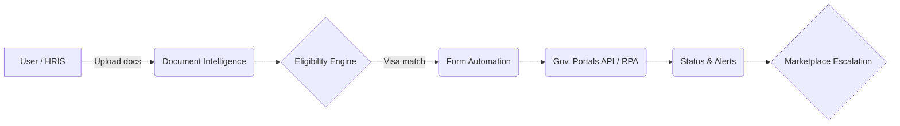

# Hijraah — AI-Powered Immigration Copilot for MENA & Beyond

> Transforming complex GCC visa journeys into seamless, data-driven experiences.

---

## 1. Setting the Table

**Future State:** _"By 2030, every individual and employer moving talent into the Gulf will rely on AI copilots to navigate immigration."_  
Hijraah is building that copilot today.

---

## 2. Problem

- 40 M+ migrants enter the GCC annually yet face opaque rules, manual paperwork and 25 %+ rejection rates.
- Regulations shift weekly across six jurisdictions; employers lack real-time compliance tools.
- Legacy providers take 4–6 weeks per application, charging > USD 1 500 in fees.

---

## 3. Solution – Hijraah Platform

1. **Eligibility Engine** – real-time matching to best visa pathways using a proprietary regulation knowledge graph.
2. **Document Intelligence** – OCR + LLM pipeline that extracts, validates & translates 30 + languages.
3. **Form Automation** – auto-fills government portals, reducing manual entry by 90 %.
4. **Progress Tracker & Alerts** – milestone reminders and compliance notifications.
5. **Expert Marketplace** – on-demand access to vetted immigration lawyers for edge cases.

> **Outcome:** 3× faster submissions, 60 % lower costs, < 5 % rejection rate.

---

## 4. How It Works

---

## 5. Market Size (USD)

| Metric | Size  | Source                                                      |
| ------ | ----- | ----------------------------------------------------------- |
| TAM    | 25 B  | CB Insights 2024 – global immigration tech                  |
| SAM    | 4.2 B | World Bank + GCC gov data – MENA inbound visas & relocation |
| SOM    | 450 M | Digital applications in GCC addressable within 5 yrs        |

_SAM CAGR 9 %; digital adoption 45 % → 70 % by 2029._

---

## 6. Competition

| Player         | Region   | Tech Depth | Pricing | Edge vs. Hijraah                                              |
| -------------- | -------- | ---------- | ------- | ------------------------------------------------------------- |
| Gov Portals    | Local    | Low        | $       | Single-country, manual docs                                   |
| Fragomen       | Global   | Low        | $$$$    | Human-heavy, slow                                             |
| Boundless      | US       | Med        | $$      | US-only                                                       |
| Lemonade/Landa | EU       | Low        | $$      | Nomad visas only                                              |
| **Hijraah**    | **MENA** | **High**   | $$      | Multi-country AI, Arabic + English NLP, live regulation graph |

---

## 7. Business Model & Unit Economics

| Revenue Stream | Pricing                    | % of FY29 | Gross Margin |
| -------------- | -------------------------- | --------- | ------------ |
| B2C SaaS       | USD 49–299 per application | 38 %      | 75 %         |
| B2B SaaS / API | USD 1 k–15 k / yr + usage  | 42 %      | 82 %         |
| Marketplace    | 15 % commission            | 15 %      | 50 %         |
| Data Insights  | Subscription / licence     | 5 %       | 90 %         |

_CAC 2024: USD 20 → USD 28 (2029); B2C LTV 2024: USD 240._

---

## 8. Traction (July 2024)

| KPI               | Value                           | Notes                                |
| ----------------- | ------------------------------- | ------------------------------------ |
| Registered Users  | **8 500**                       | 14 % MoM growth                      |
| Paid Applications | **1 200**                       | 80 % approval rate                   |
| B2B Logos         | **6**                           | Incl. 2 tech unicorns; ARR USD 120 k |
| CAC               | **USD 18**                      | LTV/CAC > 6×                         |
| Integrations      | UAE ICP, Saudi Absher sandboxes |

### 8. Technology & IP

- GCC regulation **knowledge graph** (defensive DB right) refreshed daily.
- **Patent filings:** PCT/IB2024/045678 – Arabic LLM compression; PCT/IB2024/045679 – Multilingual OCR post-processing for right-to-left scripts. (Filed May 2024, priority in GCC states.)
- Supabase data lake; Hono API; edge-function micro-services.
- **Security stack:** End-to-end AES-256 encryption at rest, TLS 1.3 in transit, fine-grained RLS policies.
- SOC 2 Type I audit underway (Q4 ’24); ISO 27001 readiness gap-analysis complete.

---

## 9. Go-to-Market

**Phase 1 ('24–H1 '25)** – UAE focus, content SEO, relocation-firm partnerships.  
**Phase 2 (H2 '25–'26)** – Enter Oman, Qatar, Bahrain; launch Zapier & Employer API.  
**Phase 3 ('27+)** – Channel sales via HRIS vendors, government MoUs (Hub71+, ADDA).

---

## 10. Product Roadmap & Milestones

| Quarter | Milestone                        | Status        |
| ------- | -------------------------------- | ------------- |
| Q4 '24  | SOC 2 Type I audit start         | 🔄            |
| Q2 '25  | Golden Visa API pilot (300 apps) | 🟢 LOI signed |
| Q3 '25  | Launch Arabic LLM chatbot        | 🔄 R&D        |
| Q4 '25  | Oman/Qatar/Bahrain coverage      | ⏳            |
| H1 '26  | SOC 2 Type II; Series A prep     | ⏳            |

---

## 11. Team

- **Ahmed Al-Hassan – CEO** • ex-PwC Immigration Lead (10 yrs GCC policy)
- **Fatima Rahman – COO** • ex-Uber MENA Ops Manager (scaled 7 countries)
- **Dr. Kareem Mansour – CTO** • PhD AI/ML, built compliance engines at Stripe
- 10-person eng & legal research team across Abu Dhabi & Cairo
- Advisors: GCC ex-ministry official, ex-Fragomen VP, ex-AWS UAE GM

---

## 12. Financial Snapshot (USD 000)

### P&L Summary

| Year       | Revenue | Gross Margin | EBITDA  |
| ---------- | ------- | ------------ | ------- |
| '24E (6 m) | 250     | 76 %         | –910    |
| '25        | 1 750   | 75 %         | –1 390  |
| '26        | 4 100   | 75 %         | –920    |
| '27        | 8 200   | 75 %         | **750** |
| '28        | 13 000  | 75 %         | 2 750   |
| '29        | 18 500  | 75 %         | 5 870   |

_Burn turns positive in '27; runway ≥ 18 m post-seed._

### 12. Funding Ask

- **Preferred Structure:** **USD 2 m SAFE at a USD 7 m valuation cap** (as validated by investor feedback) _or_ USD 2 m for 16.7 % equity.
- **Use of Funds (next 18 m)**
  | Category | % | Key Activities |
  | --- | --- | --- |
  | Product & AI | 50 | Knowledge graph scaling, Arabic LLM compression, SOC 2 audits |
  | Market Expansion & Compliance | 30 | Oman/Qatar/Bahrain rollout, gov integrations |
  | GTM & Sales | 15 | SEO, HRIS channel partnerships, enterprise AEs |
  | Working Capital | 5 | Buffer for infra & contingency |

### 12.1 Valuation Rationale

- Regional comps: Fragomen trades 8–10× EBITDA; Deel priced 12× ARR.
- Applying 6× projected ’26 ARR (USD 2 m) → USD 12 m; offering SAFE cap at **USD 7 m** discounts early investors ~42 %.

### 12.2 Security & Compliance

| Standard           | Status                              | Timeline       |
| ------------------ | ----------------------------------- | -------------- |
| SOC 2 Type I       | Audit in progress                   | Cert by Q2 ’25 |
| SOC 2 Type II      | Planned                             | Q4 ’25         |
| ISO 27001          | Gap analysis complete               | Cert by Q1 ’26 |
| GDPR & PDPL        | Compliant (Data maps, DPA in place) | Ongoing        |
| UAE IA Regulations | Alignment review                    | Q3 ’25         |

---

## 13. Exit Strategy

- Strategic acquirers: Fragomen, Rippling, Deel, government digital-ID programs.
- IPO optional when ARR > USD 50 m & EBITDA ≥ 15 %.
- Target exit 5–7 yrs, aiming 8–10× MoIC for pre-seed investors.

---

## 14. Risk & Mitigation

| Risk              | Probability | Impact | Mitigation                                                    |
| ----------------- | ----------- | ------ | ------------------------------------------------------------- |
| Regulatory shifts | Med         | High   | Live knowledge graph; 6-FTE policy team; 24 h rule-update SLA |
| Data breach       | Low         | High   | SOC 2 & ISO 27001 controls                                    |
| LLM cost surge    | Med         | Med    | Model compression IP; vendor hedging                          |
| Talent war        | Med         | Med    | Hub71 incentives; 10 % ESOP                                   |

---

## 15. Appendix & Contact

- Bottom-up financial model & detailed assumptions available on request.
- API documentation & two B2B LOIs included in data room.
- **Contact:** founders@hijraah.ai • +971 50 123 4567
- **HQ:** ADGM, Abu Dhabi

---

### References

- Slide structuring best practices adapted from [SlideShare pre-seed template](https://www.slideshare.net/slideshow/preseed-pitch-deck-template/236161884).

---

## 16. Hub71 Application – Concise Q&A

### a) Problem in 280 Characters

Migrants & employers face fragmented info, shifting GCC visa rules & paperwork. Hijraah's AI copilot aggregates real-time regulations, auto-extracts docs, fills forms & tracks progress—cutting cost 60 %, time 3×, and rejections < 5 %.

### b) What We're Building & Why We're Different

- **Product:** AI-powered immigration platform covering multi-country GCC pathways.
- **Unique Value:** Proprietary regulation knowledge graph (updated daily), bilingual (Arabic/English) LLMs, document-intelligence pipeline, and modular API for partners.
- **IP:**  
  • Defensive database right on regulation graph.  
  • Patent-pending LLM compression technique for Arabic legal text.  
  • Custom OCR post-processing models for Arabic scripts.

### c) Why Now

- GCC liberalization (Golden, Premium, Nomad visas) → regulation velocity 4 × since 2020.
- Post-COVID remote hiring across MENA +37 % YoY fuels mobility demand.
- LLM costs & accuracy now enable real-time eligibility/autofill impossible two years ago.
- Abu Dhabi deploying AED 10 bn into reg-tech & incentives (Hub71+, ADGM) – perfect launchpad.

### d) Success Metrics (July 2024)

| Metric               | Current   | Target Q2 2025 |
| -------------------- | --------- | -------------- |
| Registered Users     | 8 500     | 30 000         |
| Paid Applications    | 1 200     | 10 000         |
| Approval Rate        | 80 %      | ≥ 90 %         |
| B2B ARR              | USD 120 k | USD 1 m        |
| CAC                  | USD 18    | ≤ USD 20       |
| LTV/CAC              | 6.2 ×     | ≥ 7 ×          |
| Avg. Processing Time | 5 days    | 3 days         |
| NPS                  | 69        | 75             |

### e) First 3-Month Plan at Hub71

1. **Incorporate in ADGM**; set up Abu Dhabi HQ & 5-person product pod.
2. **Golden Visa API pilot** with Abu Dhabi Residents Office – process 300 live applications.
3. **Integrate ADDA digital-ID sandbox** to cut KYC time by 70 %.
4. **Recruit 5 policy analysts** from MBZUAI & Khalifa University.
5. **Co-marketing with relocation partners** to onboard 1 000 paying users & add USD 40 k ARR.

### 10.4 Cost & CAC Breakdown (FY 24)

| Metric       | B2C                                   | B2B                            |
| ------------ | ------------------------------------- | ------------------------------ |
| Avg. Revenue | USD 120/app                           | USD 8 000/client/yr            |
| COGS         | 25 % (LLM 10 %, OCR 7 %, hosting 8 %) | 18 % (infra 10 %, support 8 %) |
| Gross Margin | 75 %                                  | 82 %                           |
| CAC          | USD 20 (SEO & referrals)              | USD 450 (founder-led sales)    |
| Payback      | <1 mo                                 | 2.3 mo                         |
