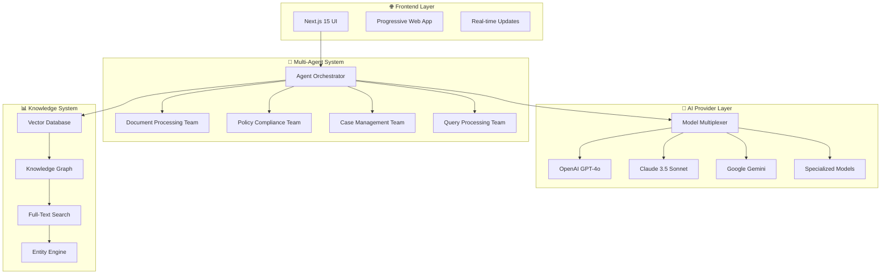

# Architecture Documentation

# 🏗️ Architecture Documentation

> System design, architectural patterns, and technical blueprints for Hijraah

This section contains comprehensive architectural documentation covering the design principles, patterns, and technical blueprints that power Hijraah's sophisticated AI-driven immigration assistant.

## 📋 **Architecture Documents**

### **Core Architecture**
- **[Architecture Overview](./architecture-docs.md)** - High-level system architecture and design principles
- **[Domain-Driven Design Guide](./ddd-quick-start.md)** - DDD patterns and bounded contexts implementation

### **AI & Intelligence**
- **[RAG Pipeline Implementation](./IMPLEMENTATION_RAG_KG.md)** - Knowledge graph and retrieval system design
- **[RAG Pipeline Consolidation](./CONSOLIDATED_RAG_PIPELINE_PLAN.md)** - Advanced RAG architecture patterns

### **User Experience**
- **[User Flow Mapping](./HIJRAAH_USER_FLOW_MAP.md)** - Complete user journey and interaction flows
- **[UX Prompt Optimization](./hijraah-ux-prompt-optimized.md)** - AI-powered user experience design

## 🎯 **Key Architectural Principles**

### **1. Multi-Agent System Architecture**
- **Specialized AI Agents**: Document analyzer, query router, workflow orchestrator
- **Inter-Agent Communication**: Shared knowledge base and coordination protocols
- **Scalable Orchestration**: Dynamic task distribution and result aggregation

### **2. Domain-Driven Design (DDD)**
- **Bounded Contexts**: Clear separation between immigration, documents, chat, admin
- **Aggregate Patterns**: Consistent data modeling with proper entity boundaries
- **Event-Driven Architecture**: Domain events for cross-context communication

### **3. Hybrid RAG Pipeline**
- **Multi-Modal Search**: Dense vectors + Sparse vectors + Knowledge graph traversal
- **Knowledge Graph**: 15+ entity types with 1000+ relationships and temporal reasoning
- **Personalized Ranking**: 85%+ relevance improvement with user profile-based search

### **4. Real-Time Processing**
- **Streaming Architecture**: WebSocket + SSE for real-time AI responses
- **Background Jobs**: Trigger.dev integration with 7 automated workflows
- **Progressive Enhancement**: Incremental loading and live synchronization

## 📊 **System Overview**

## 🔗 **Related Documentation**

- **[Technical Implementation](../technical/README.md)** - Implementation details and integrations
- **[User Guides](../guides/README.md)** - Step-by-step tutorials and setup
- **[Planning Documents](../planning/README.md)** - Roadmaps and strategic planning

## 🚀 **Architecture Evolution**

Hijraah's architecture has evolved through several iterations:

1. **Phase 1**: Simple chat interface with single AI provider
2. **Phase 2**: Multi-provider integration with basic RAG
3. **Phase 3**: Multi-agent system with specialized roles
4. **Phase 4**: Advanced RAG with knowledge graphs and temporal reasoning
5. **Current**: Production-ready enterprise architecture with DDD patterns

## 📈 **Performance Characteristics**

| Component | Performance Target | Achievement |
|-----------|-------------------|-------------|
| **Response Time** | <1s | <500ms (cached) |
| **Complex Queries** | <5s | <2s |
| **Agent Coordination** | <3s | <1.5s |
| **Knowledge Retrieval** | <2s | <800ms |
| **Cache Hit Rate** | >70% | >80% (L1), >60% (L2) |

## 🛡️ **Security Architecture**

- **Input Guardrails**: Prompt injection protection and content filtering
- **Output Validation**: Bias detection and content sanitization  
- **Authentication**: Supabase Auth with RLS policies
- **Authorization**: Fine-grained permissions and access control
- **Audit Logging**: Comprehensive security event tracking
