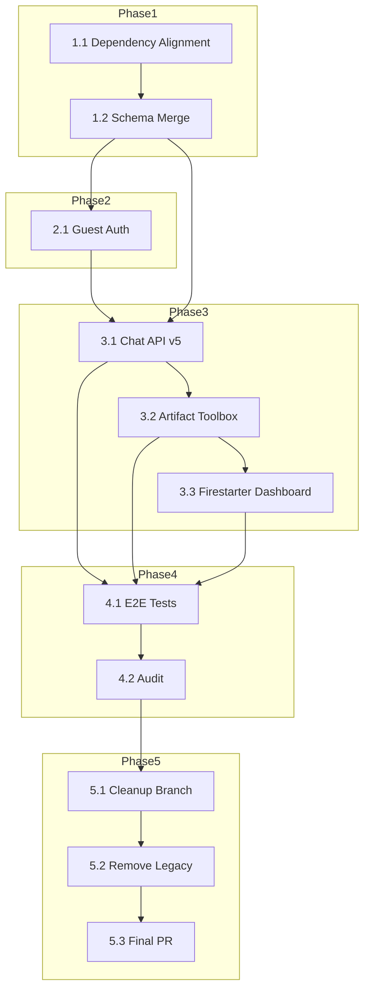

# Hijraah Integration & Migration Plan v3 (Context7-Aligned)

> **Status:** DRAFT – _generated by Context7 planning assistant_

---

## 0. Guiding Principles

1. **Context7 Compliance** – follow the seven pillars: Observability, Modularity, Resumability, Tracing, Data-as-Code, IaC, and Provider Isolation.
2. **Single Source of Truth** – avoid duplication across UI components, database schema, and business logic.
3. **Progressive Migration** – ship in small, reviewable PRs guarded by feature flags.
4. **Backward Compatibility** – keep existing Hijraah production surfaces stable during migration.
5. **Cleanup Discipline** – remove legacy code only after the new path is live and verified.

---

## 1. Phase Roadmap

| Phase | Goal                   | Key Tasks                                                                               | Depends On |
| ----- | ---------------------- | --------------------------------------------------------------------------------------- | ---------- |
| 0     | Pre-Migration Analysis | P-1 Analyse `ai-chatbot`<br/>P-2 Analyse `firestarter`                                  | —          |
| 1     | Foundation & Parity    | 1.1 Dependency Alignment<br/>1.2 Schema Merge                                           | 0          |
| 2     | Auth Upgrade           | 2.1 Guest-User Provider                                                                 | 1          |
| 3     | Core Feature Port      | 3.1 AI SDK v5 Chat API<br/>3.2 Artifact Toolbox & Editors<br/>3.3 Firestarter Dashboard | 1,2        |
| 4     | QA & Verification      | 4.1 E2E & Playwright Tests<br/>4.2 Performance & Security Audit                         | 3          |
| 5     | Cleanup                | 5.1 `migration-cleanup` branch<br/>5.2 Remove legacy apps<br/>5.3 Final PR              | 4          |

---

## 2. Detailed Task List

### Phase 1 – Foundation & Parity

**Task 1.1 – Dependency Alignment**

- **Source**: `ai-chatbot/package.json`, `firestarter/package.json`
- **Target**: `apps/web/package.json`
- **Action**:
  - Diff and merge dependencies – especially `ai@5.0.0-beta.6`, `@ai-sdk/react`, `next-auth@*`, `drizzle-orm`, `@vercel/blob`, `@vercel/functions`.
  - Add `Context7` observability libs if missing (e.g. `@sentry/nextjs`).
- **Context7 Pillar**: _Provider Isolation_ (ensure version pinning).

**Task 1.2 – Schema Merge & Supabase Migration**

- Merge Drizzle schemas from `ai-chatbot/lib/db/schema.ts` into `packages/database/src/schema.ts`.
- Generate new SQL migration in `supabase/migrations/2024XXXX_ai_chatbot_merge.sql`:
  - Tables: `Suggestion`, `Document`, `Vote_v2`, `Stream`.
  - `CREATE TABLE IF NOT EXISTS` semantics to stay idempotent.
- Update Zod validators & Drizzle models.
- **Context7 Pillar**: _Data-as-Code_.

### Phase 2 – Auth Upgrade

**Task 2.1 – Guest-User Provider**

- Port `ai-chatbot/app/(auth)/auth.ts` "guest" credentials provider into `apps/web` NextAuth config.
- Keep existing social/OAuth providers untouched.
- Middleware update for automatic guest redirect (`/api/auth/guest`).
- **Observability**: add trace for guest session creation.

### Phase 3 – Core Feature Port

**Task 3.1 – AI SDK v5 Chat API**

- Replace current `apps/web` chat route with `streamText` / `createUIMessageStream` pattern from `ai-chatbot/app/(chat)/api/chat/route.ts`.
- Ensure provider abstraction (`myProvider`) maps to Hijraah's model registry.
- Implement Resumable Streams via Redis (respect existing infra variables).
- **Context7 Pillars**: _Resumability_, _Tracing_.

**Task 3.2 – Artifact Toolbox & Editors**

- Copy ProseMirror editors, diff view, artifact components under `apps/web/src/components/artifacts/*`.
- De-duplicate: re-use existing shadcn UI primitives; only port business logic & custom hooks (`use-artifact`, editors, diff utils).
- Integrate with Hijraah dashboard routes: add new "Artifacts" tab.
- Backend: move `/api/document`, `/api/suggestions`, `/api/files/*`, `/api/vote` into `apps/web/src/app/api/rag/*`.
- **Context7 Pillar**: _Modularity_.

**Task 3.3 – Firestarter Dashboard Integration**

- Re-create `/dashboard`, `/indexes`, `/debug` as sub-routes in Hijraah.
- Align styling & global state (use Zustand/Context if present).

### Phase 4 – QA & Verification

**Task 4.1 – End-to-End Tests**

- Port Playwright suites from `ai-chatbot/tests/e2e/*` and `firestarter` tests.
- Ensure CI matrix runs against both Chrome & WebKit.

**Task 4.2 – Performance & Security Audit**

- Run lighthouse and Supabase advisor checks.
- Verify message/day limits, rate limit middleware, blob upload quotas.

### Phase 5 – Cleanup

**Task 5.1 – Create `migration-cleanup` Branch**

```bash
git checkout -b migration-cleanup
```

**Task 5.2 – Remove Legacy Apps**

- After green tests on GH Actions, delete `ai-chatbot/` and `firestarter/` directories.
- Run `pnpm prune && pnpm dedupe` at workspace root.

**Task 5.3 – Open PR for Final Review**

```bash
gh pr create --title "feat: Consolidate ai-chatbot & firestarter into core Hijraah" \
  --body "This PR merges all chat, artifact, and scraping features into apps/web, upgrades AI SDK to v5, adds guest auth, and removes redundant packages."
```

---

## 3. Dependency Graph (Mermaid)



---

## 4. Environment & Config Changes

| Variable                | New?      | Description                                       |
| ----------------------- | --------- | ------------------------------------------------- |
| `AI_PROVIDER`           | ✅        | Default AI provider for `myProvider` abstraction. |
| `REDIS_URL`             | ⚠️ ensure | Required for Resumable Streams.                   |
| `BLOB_READ_WRITE_TOKEN` | ✅        | For image/file uploads via `@vercel/blob`.        |

---

## 5. Rollback Strategy

1. Keep legacy apps behind `legacy/*` routes until Phase 5.
2. Feature flag guest auth and new chat API via `NEXT_PUBLIC_FEATURE_*` env vars.
3. If issues arise, disable flags & redeploy – no DB writes are destructive.

---

## 6. Review Checklist

- [ ] All CI jobs green (build, lint, e2e, type-check).
- [ ] Supabase migrations applied in staging.
- [ ] Guest auth sessions observed in analytics.
- [ ] Artifact toolbox functional inside dashboard.
- [ ] Firestarter scraping jobs run from new UI.
- [ ] Legacy directories removed post-merge.

---

## Appendix: V2 Plan (Archived)

<details>
<summary>Click to expand</summary>

# Hijraah Integration & Migration Plan v2

## 1. Overview

This document outlines the comprehensive, Context7-aligned plan to migrate core functionalities from the `ai-chatbot` and `firestarter` applications into the primary `apps/web` (Hijraah) application. The end goal is to create a single, unified, and streamlined application within the monorepo, subsequently removing the `ai-chatbot` and `firestarter` directories to eliminate redundancy and improve maintainability.

**Core Principles:**

- **Context7 Alignment**: All new and migrated code will adhere to Context7 patterns for scalability, observability, and maintainability.
- **Single Source of Truth**: Consolidate UI components, backend logic, and data schemas to avoid duplication.
- **Incremental Migration**: Systematically move, refactor, and verify features in phases to ensure stability.
- **Modernization**: Upgrade the core AI implementation to leverage the latest features of the Vercel AI SDK v5, as demonstrated in `ai-chatbot`.

---

## 2. Pre-Migration Analysis & Inventory

This phase involves a deep analysis of the source directories to create a clear inventory of components, services, and logic to be migrated, modified, or deprecated.

- **Task P-1: Analyze `ai-chatbot` Directory**

  - **Status**: `COMPLETE`
  - **Details**: Catalog all UI components (especially the artifact system), NextAuth.js implementation (guest mode), AI SDK usage, Drizzle schema, and API routes.
  - **Key Finding**: `ai-chatbot` contains a complete, modern implementation of a RAG system with a rich artifact toolbox (`text`, `code`, `image`, `sheet`) and advanced AI SDK v5 patterns.

- **Task P-2: Analyze `firestarter` Directory**
  - **Status**: `COMPLETE`
  - **Details**: Catalog the Firecrawl/Upstash-based scraping and indexing dashboard, UI components, and API routes.
  - **Key Finding**: `firestarter` provides a self-contained scraping management interface that can be integrated into the main `apps/web` RAG dashboard.

---

## 3. Phased Migration Plan

### Phase 1: Foundational Scaffolding

This phase prepares `apps/web` to receive the new features by aligning dependencies and database schemas.

- **Task 1.1: Dependency Alignment**

  - **Status**: `PENDING`
  - **Description**: Update the `package.json` in `apps/web` to include all necessary dependencies from `ai-chatbot` and `firestarter`. This includes `@ai-sdk/react`, `@ai-sdk/xai`, `next-auth` extensions, `drizzle-orm`, and any other required libraries.
  - **Action**: Run a diff on `package.json` files and merge dependencies.
  - **Context7 Pattern**: **Dependency Injection** - Ensuring the host application has the required modules before injecting new features.

- **Task 1.2: Database Schema Migration & Unification**
  - **Status**: `PENDING`
  - **Dependencies**: `Task 1.1`
  - **Description**: Merge the Drizzle schemas. This involves creating a new Supabase migration script in the `hijraah/supabase/migrations` directory. The script will add the new tables (`Suggestion`, `Document`, `Vote_v2`, `Stream`) from `ai-chatbot` and modify existing tables as needed.
  - **Action**:
    1.  Analyze `ai-chatbot/lib/db/schema.ts` and its migrations.
    2.  Create a new `.sql` migration file in `supabase/migrations`.
    3.  Define `CREATE TABLE IF NOT EXISTS` statements for all new tables.
    4.  Update the central Drizzle schema in `packages/database` to reflect the unified structure.
  - **Context7 Pattern**: **Schema Federation** & **Database-as-Code**.

---

### Phase 2: Core Feature Migration

This phase involves migrating the core user-facing features and backend services.

- **Task 2.1: Guest Authentication Integration**

  - **Status**: `PENDING`
  - **Dependencies**: `Task 1.1`, `Task 1.2`
  - **Description**: Port the "guest user" functionality from `ai-chatbot` into `apps/web`'s existing NextAuth.js setup. This allows unauthenticated users to interact with the application within defined limits.
  - **Action**:
    1.  Adapt the `Credentials` provider for 'guest' mode from `ai-chatbot/app/(auth)/auth.ts`.
    2.  Integrate the guest-handling logic from `ai-chatbot/middleware.ts` into `apps/web`'s middleware.
  - **Context7 Pattern**: **Graceful Degradation** - Providing a functional, limited experience for unauthenticated users.

- **Task 2.2: Artifact System & Editor Migration**

  - **Status**: `PENDING`
  - **Dependencies**: `Task 1.1`
  - **Description**: Migrate the complete artifact toolbox (Diff View, ProseMirror editors for text, code, sheets, and images) from `ai-chatbot` into the `apps/web/src/components/ui` directory.
  - **Action**:
    1.  Copy and refactor artifact-related components from `ai-chatbot/components` and `ai-chatbot/artifacts`.
    2.  Integrate the components into the `UnifiedChatInterface` within `apps/web`.
    3.  Migrate backend logic from `ai-chatbot/artifacts/*/server.ts` to corresponding API routes in `apps/web`.
  - **Context7 Pattern**: **Factory Pattern** - Using the `createDocumentHandler` to manage different artifact types.

- **Task 2.3: Firestarter Scraping Dashboard Integration**
  - **Status**: `PENDING`
  - **Dependencies**: `Task 1.1`
  - **Description**: Merge the `firestarter` UI into the main Hijraah dashboard as a new tab or section for managing scraping and indexing tasks.
  - **Action**:
    1.  Re-create the Firestarter dashboard pages (`/dashboard`, `/indexes`, `/debug`) as components within `apps/web/src/components/ui/dashboard/`.
    2.  Migrate the backend API routes (`/api/firestarter/*`, `/api/scrape`) into `apps/web/src/app/api/rag/ingestion/`.
  - **Context7 Pattern**: **Dashboard Aggregation** - Consolidating multiple management UIs into a unified dashboard.

---

### Phase 3: AI Implementation Upgrade

This phase focuses on modernizing the AI capabilities of `apps/web` using the advanced patterns from `ai-chatbot`.

- **Task 3.1: Refactor Chat API with Vercel AI SDK v3**
  - **Status**: `PENDING`
  - **Dependencies**: `Task 2.1`, `Task 2.2`
  - **Description**: Upgrade the existing chat API in `apps/web` to use the Vercel AI SDK v3 streaming and tool-calling patterns found in `ai-chatbot/app/(chat)/api/chat/route.ts`.
  - **Action**:
    1.  Replace the existing chat stream implementation with `streamText` and `streamObject` from the AI SDK.
    2.  Integrate the `extractReasoningMiddleware` for transparent AI reasoning.
    3.  Refactor tool-calling logic to match the modern, schema-based approach.
  - **Context7 Pattern**: **Provider Integration** & **Observability** (through reasoning extraction).

---

### Phase 4: Cleanup and Verification

This is the final phase to ensure a clean codebase and prepare for the removal of the old directories.

- **Task 4.1: Create `migration-cleanup` Branch**

  - **Status**: `PENDING`
  - **Dependencies**: All previous tasks.
  - **Description**: Create a dedicated Git branch named `migration-cleanup` to isolate the final removal and refactoring changes.
  - **Action**: `git checkout -b migration-cleanup`.

- **Task 4.2: Codebase Consolidation and Removal**

  - **Status**: `PENDING`
  - **Dependencies**: `Task 4.1`
  - **Description**: After verifying that all features have been successfully migrated and integrated, systematically delete the `ai-chatbot` and `firestarter` directories.
  - **Action**:
    1.  Conduct a final review of all migrated features.
    2.  Run all tests (`lint`, `build`, `e2e`) to ensure no regressions.
    3.  Delete the `ai-chatbot` and `firestarter` folders.
    4.  Remove any dead code or unused dependencies from the root `package.json` and other configuration files.

- **Task 4.3: Create Final Pull Request**
  - **Status**: `PENDING`
  - **Dependencies**: `Task 4.2`
  - **Description**: Create a pull request from the `migration-cleanup` branch to `main`, detailing all the changes made, the rationale for the migration, and a summary of the new, unified architecture. This PR will serve as the final review gate before the old code is permanently removed.
  - **Action**: `gh pr create --title "feat: Consolidate ai-chatbot and firestarter into core app" --body "..."`

</details>

---

> **Generated:** {{DATE}} – please review and adjust before execution.
