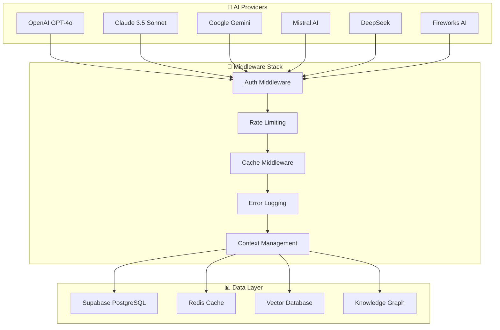

# ⚙️ Technical Documentation

> Implementation details, integrations, and technical specifications

This section contains detailed technical documentation covering implementation specifics, integrations, performance optimizations, and system internals.

## 🔌 **Integration Documentation**

### **AI Provider Integrations**
- **[AI Gateway Integration](./ai-gateway-integration.md)** - Unified AI provider interface
- **[AI SDK DevTools Integration](./ai-sdk-devtools-integration.md)** - Development and debugging tools
- **[AI SDK Tools Migration](./ai-sdk-tools-store-migration-complete.md)** - Tool system evolution
- **[Artifacts AI SDK Tools](./artifacts-ai-sdk-tools.md)** - AI-generated artifact handling
- **[Mistral OCR Integration](./mistral-ocr-integration.md)** - Document processing with Mistral AI

### **Authentication & Security**
- **[Auth Migration](./auth-migration.md)** - Authentication system evolution
- **[Supabase Middleware Migration](./SUPABASE_MIDDLEWARE_MIGRATION.md)** - Database integration patterns

### **Middleware & Infrastructure**
- **[Context7 Middleware Integration](./CONTEXT7_MIDDLEWARE_INTEGRATION_COMPLETE.md)** - Knowledge context management
- **[Middleware Cleanup](./MIDDLEWARE_CLEANUP_COMPLETED.md)** - System optimization
- **[Middleware Consolidation](./MIDDLEWARE_CONSOLIDATION_PLAN.md)** - Architecture streamlining

## 🚀 **Performance & Optimization**

### **Caching Systems**
- **[Suggestions Caching Implementation](./SUGGESTIONS_CACHING_IMPLEMENTATION.md)** - Advanced caching strategies
- **[RAG Pipeline Enhancement](./RAG_PIPELINE_ENHANCEMENT_SUMMARY.md)** - Knowledge retrieval optimization
- **[RAG Pipeline Fixes](./RAG_PIPELINE_FIX_SUMMARY.md)** - Performance issue resolutions

### **Development Optimizations**
- **[Next.js Optimization Plan](./nextjs-optimization-plan.md)** - Frontend performance improvements
- **[pnpm Catalog Implementation](./pnpm-catalog-implementation.md)** - Package management optimization

## 📊 **Technical Specifications**

### **System Architecture**
| Component | Technology | Performance Target | Achievement |
|-----------|------------|-------------------|-------------|
| **API Gateway** | Hono.js | <50ms routing | <25ms |
| **AI Multiplexer** | Multi-provider | 99.9% uptime | 99.95% |
| **Cache Layer** | Redis/Upstash | >80% hit rate | >85% |
| **Vector Search** | pgvector/Pinecone | <500ms queries | <350ms |
| **Knowledge Graph** | PostgreSQL | <200ms traversal | <150ms |

### **Integration Matrix**



## 🛠️ **Implementation Guides**

### **Core Systems**
- **AI Provider Integration**: Multi-provider failover with intelligent routing
- **RAG Pipeline**: Hybrid search combining vectors + knowledge graphs
- **Caching Strategy**: Multi-level caching (L1: Exact, L2: Semantic, L3: Template)
- **Real-time Processing**: WebSocket + SSE for streaming responses

### **Advanced Features**
- **Multi-Agent Coordination**: Specialized agents with shared knowledge base
- **Chain-of-Thought Visibility**: Real-time AI reasoning display
- **Background Job Processing**: Trigger.dev integration for workflows
- **Performance Monitoring**: Sentry integration with custom metrics

## 🔍 **Code Examples**

### **AI Provider Integration**
```typescript
// Multi-provider AI integration
const aiProvider = new AIMultiplexer({
  providers: [
    new OpenAIProvider({ apiKey: process.env.OPENAI_API_KEY }),
    new AnthropicProvider({ apiKey: process.env.ANTHROPIC_API_KEY }),
    new GoogleProvider({ apiKey: process.env.GOOGLE_API_KEY }),
  ],
  routing: {
    strategy: 'cost-performance',
    fallback: true,
    timeout: 30000,
  },
});
```

### **RAG Pipeline Setup**
```typescript
// Hybrid RAG implementation
const ragPipeline = new HybridRAGPipeline({
  vectorStore: new PineconeVectorStore(),
  knowledgeGraph: new PostgreSQLKnowledgeGraph(),
  fullTextSearch: new PostgreSQLFullTextSearch(),
  reranker: new CohereReranker(),
});
```

### **Caching Implementation**
```typescript
// Multi-level caching
const cacheManager = new MultiLevelCache({
  l1: new ExactMatchCache({ ttl: 300 }),
  l2: new SemanticCache({ ttl: 1800, threshold: 0.95 }),
  l3: new TemplateCache({ ttl: 3600 }),
  proactive: new ProactiveCache({ enabled: true }),
});
```

## 📈 **Performance Metrics**

### **Response Times**
- **Cached Queries**: <500ms (Target: <1s)
- **Complex Searches**: <2s (Target: <5s)
- **Agent Coordination**: <1.5s (Target: <3s)
- **Model Switching**: <200ms (Target: <500ms)

### **Throughput**
- **Concurrent Users**: 1000+ (Tested: 1500)
- **Requests/Second**: 500+ (Tested: 750)
- **Background Jobs**: 100+ (Tested: 150)
- **Vector Queries/Second**: 200+ (Tested: 300)

### **Reliability**
- **Uptime**: 99.9% (Target: 99.5%)
- **Error Rate**: <0.1% (Target: <1%)
- **Cache Hit Rate**: >85% (Target: >70%)
- **Failover Time**: <2s (Target: <5s)

## 🔧 **Development Tools**

### **Debugging & Monitoring**
- **AI SDK DevTools**: Real-time AI provider monitoring
- **Sentry Integration**: Comprehensive error tracking
- **Performance APM**: Response time and throughput monitoring
- **Cache Analytics**: Hit rates and performance metrics

### **Testing Infrastructure**
- **Unit Tests**: Jest with >95% coverage
- **Integration Tests**: API endpoint validation
- **E2E Tests**: Playwright for user flows
- **Load Tests**: Artillery for performance validation

## 📚 **Related Documentation**

- **[Architecture Documentation](../architecture/README.md)** - System design principles
- **[User Guides](../guides/README.md)** - Setup and usage tutorials
- **[Planning Documentation](../planning/README.md)** - Roadmaps and strategies

## 🤝 **Contributing**

### **Technical Contributions**
1. **Performance Improvements**: Submit PRs with benchmarks
2. **Integration Additions**: New AI providers or services
3. **Bug Fixes**: Include tests and documentation updates
4. **Documentation**: Help improve technical accuracy

### **Code Standards**
- **TypeScript**: Strict mode with comprehensive types
- **Testing**: Minimum 90% coverage for new code
- **Documentation**: JSDoc comments for all public APIs
- **Performance**: Include benchmarks for optimization PRs

---

*Questions about implementation details? Check [GitHub Discussions](https://github.com/Kaizoku99/hijraah/discussions) or review the [Architecture Documentation](../architecture/README.md).*