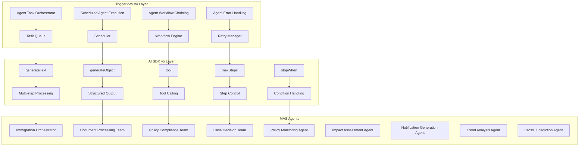

# Trigger.dev v4 Integration with AI SDK v5 Multi-Agent System

This module integrates the Hijraah Multi-Agent System (MAS) with Trigger.dev v4 for orchestration, scheduling, and workflow management using AI SDK v5 agent patterns.

## Overview

The integration provides four main components:

1. **Agent Task Orchestrator** - Orchestrates individual agent execution using Trigger.dev's `task()` with AI SDK v5's `generateText` and multi-step processing
2. **Scheduled Agent Execution** - Manages scheduled agent execution using Trigger.dev's `schedules.task()` with AI SDK v5's `maxSteps` and `stopWhen` conditions
3. **Agent Workflow Chaining** - Implements complex multi-agent workflows using Trigger.dev's `triggerAndWait()` with AI SDK v5's tool calling and result passing
4. **Agent Error Handling** - Provides comprehensive error handling using Trigger.dev's retry mechanisms with AI SDK v5's error recovery and fallback strategies

## Architecture



## Components

### 1. Agent Task Orchestrator

The Agent Task Orchestrator manages the execution of individual agent tasks using Trigger.dev's task system with AI SDK v5's multi-step processing capabilities.

**Features:**
- Support for all 9 agent types
- Multi-step processing with AI SDK v5
- Token usage tracking
- Execution context management
- Error handling integration

**Usage:**
```typescript
import { agentTaskOrchestratorTask } from '@hijraah/mas/trigger'

const request: AgentTaskRequest = {
  agentType: 'immigration_orchestrator',
  taskId: 'case-001',
  caseId: 'case-12345',
  userId: 'user-67890',
  input: {
    applicant: { name: 'John Doe', visaType: 'H1B' },
    documents: [/* documents */]
  },
  context: {
    priority: 'high',
    timeout: 600000,
    maxRetries: 3
  }
}

const result = await agentTaskOrchestratorTask.trigger(request)
```

### 2. Scheduled Agent Execution

Manages scheduled execution of agents using Trigger.dev's scheduling system with AI SDK v5 constraints.

**Features:**
- Cron-based scheduling
- AI SDK v5 constraints (`maxSteps`, `stopWhen`)
- Notification system
- Schedule management
- Dynamic agent creation

**Pre-configured Schedules:**
- **Policy Monitoring**: Every hour (`0 * * * *`)
- **Trend Analysis**: Daily at 2 AM (`0 2 * * *`)
- **Cross-Jurisdiction Analysis**: Weekly on Monday at 3 AM (`0 3 * * 1`)

**Usage:**
```typescript
import { scheduledAgentExecutionTask } from '@hijraah/mas/trigger'

const scheduledExecution: ScheduledAgentExecution = {
  scheduleId: 'policy-monitoring-hourly',
  agentType: 'policy_monitoring_agent',
  schedule: {
    cron: '0 * * * *',
    timezone: 'UTC',
    enabled: true
  },
  input: {
    sources: ['https://www.uscis.gov/news'],
    lastCheck: new Date().toISOString()
  },
  constraints: {
    maxSteps: 5,
    stopWhen: 'stepNumber >= 3',
    timeout: 600000
  }
}
```

### 3. Agent Workflow Chaining

Implements complex multi-agent workflows using Trigger.dev's `triggerAndWait()` with dependency management and result passing.

**Features:**
- Dependency graph management
- Parallel and sequential execution
- Conditional step execution
- Result passing between steps
- Workflow summary generation

**Pre-defined Workflows:**
- **Immigration Case Processing**: Complete case processing from documents to decision
- **Policy Change Impact Analysis**: Monitor, analyze, and notify about policy changes

**Usage:**
```typescript
import { agentWorkflowChainingTask, immigrationCaseProcessingWorkflow } from '@hijraah/mas/trigger'

const result = await agentWorkflowChainingTask.trigger(immigrationCaseProcessingWorkflow)
```

### 4. Agent Error Handling

Comprehensive error handling system with multiple recovery strategies and AI SDK v5 integration.

**Error Types:**
- Timeout
- Rate Limit
- Model Error
- Validation Error
- Network Error
- Authentication Error
- Resource Exhausted
- Internal Error
- Dependency Error
- Data Error

**Recovery Strategies:**
- Retry with exponential backoff
- Fallback model execution
- Fallback agent execution
- Manual intervention
- Step skipping
- Graceful degradation

**Usage:**
```typescript
import { withAgentErrorHandling, createAgentRetryStrategy } from '@hijraah/mas/trigger'

const result = await withAgentErrorHandling(
  () => executeRiskyAgent(),
  {
    taskId: 'risky-task',
    agentType: 'document_processing_team',
    maxRetries: 3,
    retryStrategy: createAgentRetryStrategy('document_processing_team')
  }
)
```

## Agent Types

The system supports 9 specialized agent types:

1. **immigration_orchestrator** - Main orchestrator for immigration cases
2. **document_processing_team** - Document analysis and processing
3. **policy_compliance_team** - Policy compliance checking
4. **case_decision_team** - Final case decision making
5. **policy_monitoring_agent** - Policy change monitoring
6. **impact_assessment_agent** - Policy impact assessment
7. **notification_generation_agent** - Notification generation
8. **trend_analysis_agent** - Trend analysis and prediction
9. **cross_jurisdiction_agent** - Cross-jurisdiction analysis

## Configuration

### Environment Variables

```bash
# Trigger.dev Configuration
TRIGGER_SECRET_KEY=your_trigger_secret_key
TRIGGER_PROJECT_ID=your_project_id

# AI SDK Configuration
OPENAI_API_KEY=your_openai_api_key
ANTHROPIC_API_KEY=your_anthropic_api_key

# Database Configuration
DATABASE_URL=your_database_url
SUPABASE_URL=your_supabase_url
SUPABASE_ANON_KEY=your_supabase_anon_key
```

### Trigger.dev Configuration

```typescript
// trigger.config.ts
import { defineConfig } from '@trigger.dev/sdk/v3'

export default defineConfig({
  project: process.env.TRIGGER_PROJECT_ID!,
  machine: {
    preset: 'large-1x'
  },
  build: {
    extensions: [
      {
        name: 'hijraah-mas',
        path: './packages/hijraah-mas/src/trigger'
      }
    ]
  }
})
```

## Examples

### Single Agent Execution

```typescript
import { agentTaskOrchestratorTask } from '@hijraah/mas/trigger'

const result = await agentTaskOrchestratorTask.trigger({
  agentType: 'policy_monitoring_agent',
  taskId: 'policy-check-001',
  input: {
    sources: ['https://www.uscis.gov/news'],
    lastCheck: new Date().toISOString()
  }
})
```

### Workflow Execution

```typescript
import { agentWorkflowChainingTask } from '@hijraah/mas/trigger'

const workflow: AgentWorkflowConfig = {
  workflowId: 'custom-workflow',
  name: 'Custom Immigration Workflow',
  description: 'Custom workflow for specific case type',
  steps: [
    {
      stepId: 'document-analysis',
      agentType: 'document_processing_team',
      input: { documents: [] },
      dependencies: []
    },
    {
      stepId: 'compliance-check',
      agentType: 'policy_compliance_team',
      input: { application: {} },
      dependencies: ['document-analysis']
    }
  ],
  triggers: [{ type: 'event', config: { eventName: 'case.submitted' } }]
}

const result = await agentWorkflowChainingTask.trigger(workflow)
```

### Error Handling

```typescript
import { withAgentErrorHandling } from '@hijraah/mas/trigger'

const safeExecution = await withAgentErrorHandling(
  async () => {
    // Your agent execution logic
    return await executeAgent()
  },
  {
    taskId: 'safe-task',
    agentType: 'immigration_orchestrator',
    maxRetries: 3,
    retryStrategy: {
      maxRetries: 3,
      baseDelay: 1000,
      maxDelay: 30000,
      backoffMultiplier: 2,
      retryableErrors: ['timeout', 'rate_limit'],
      fallbackStrategy: 'fallback_model'
    }
  }
)
```

## Testing

Run the test suite:

```bash
# Run all tests
pnpm test packages/hijraah-mas/src/trigger

# Run specific test file
pnpm test packages/hijraah-mas/src/trigger/__tests__/trigger-integration.test.ts

# Run with coverage
pnpm test:coverage packages/hijraah-mas/src/trigger
```

## Monitoring and Observability

The system provides comprehensive monitoring capabilities:

### Metrics Tracked
- Task execution times
- Success/failure rates
- Token usage and costs
- Error types and frequencies
- Recovery strategy effectiveness

### Logging
- Structured logging with context
- Step-by-step execution tracking
- Error details and stack traces
- Performance metrics

### Alerting
- Failed task notifications
- Performance degradation alerts
- Error rate threshold alerts
- Resource usage warnings

## Performance Considerations

### Optimization Strategies
- **Concurrent Execution**: Tasks run in parallel where possible
- **Intelligent Caching**: Results cached based on input similarity
- **Model Selection**: Appropriate model selection based on task complexity
- **Resource Management**: Connection pooling and resource limits

### Scaling
- **Queue Management**: Configurable concurrency limits
- **Machine Sizing**: Appropriate machine presets for different workloads
- **Timeout Management**: Reasonable timeouts to prevent resource exhaustion
- **Retry Strategies**: Exponential backoff to handle temporary failures

## Security

### Data Protection
- Input validation and sanitization
- Secure credential management
- Audit logging for all operations
- Access control and authorization

### Privacy
- PII detection and masking
- Data retention policies
- Secure data transmission
- Compliance with privacy regulations

## Troubleshooting

### Common Issues

1. **Task Timeouts**
   - Increase timeout values in task configuration
   - Optimize agent logic for better performance
   - Use streaming for long-running operations

2. **Rate Limiting**
   - Implement proper backoff strategies
   - Use multiple API keys for load distribution
   - Cache results to reduce API calls

3. **Memory Issues**
   - Use appropriate machine presets
   - Implement data streaming for large datasets
   - Clean up resources after task completion

4. **Dependency Errors**
   - Verify all required services are available
   - Implement proper health checks
   - Use circuit breakers for external dependencies

### Debug Mode

Enable debug logging:

```typescript
process.env.DEBUG = 'hijraah:mas:*'
```

## Contributing

1. Follow the existing code patterns
2. Add comprehensive tests for new features
3. Update documentation for any changes
4. Ensure all tests pass before submitting

## License

This module is part of the Hijraah platform and follows the same licensing terms.